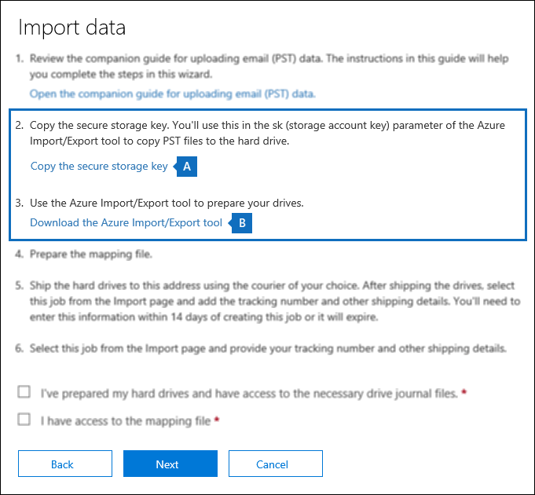
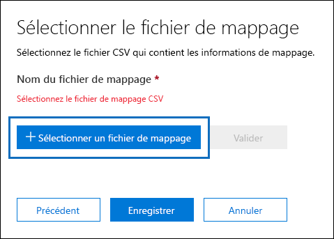
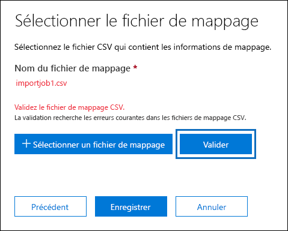
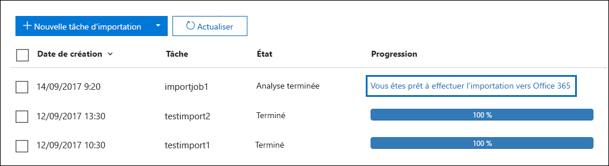
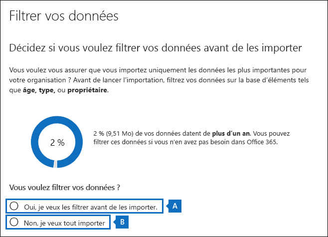
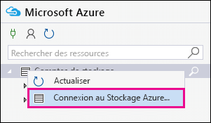
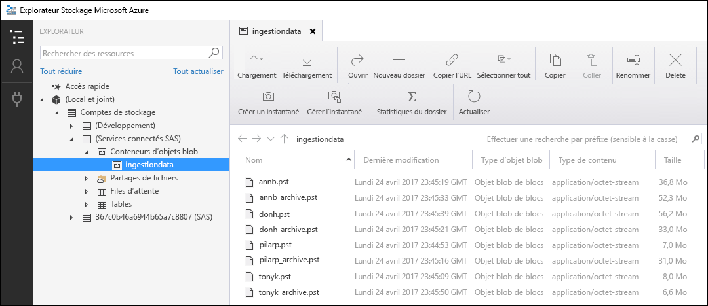
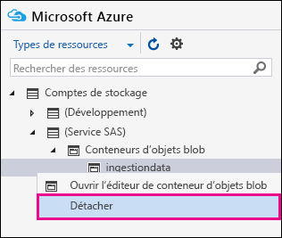

# <a name="use-drive-shipping-to-import-your-organization-pst-files-to-office-365"></a>Utiliser l'expédition de disque pour importer les fichiers PST de votre organisation vers Office 365

**Cet article est destiné aux administrateurs. Essayez-vous d'importer des fichiers PST dans votre propre boîte aux lettres? Voir [importer le courrier, les contacts et le calendrier à partir d'un fichier. pst Outlook](https://go.microsoft.com/fwlink/p/?LinkID=785075)**
   
Utilisez le service d'importation Office 365 et encouragez la livraison à importer en bloc des fichiers PST dans des boîtes aux lettres utilisateur. L’expédition de disque consiste à copier les fichiers PST sur un lecteur de disque dur et à expédier physiquement le lecteur à Microsoft. Lorsque Microsoft reçoit votre disque dur, le personnel du centre de données copie les données à partir du disque dur vers un espace de stockage dans le cloud Microsoft. Ensuite, vous avez la possibilité de découper les données PST réellement importées vers les boîtes aux lettres cibles en définissant des filtres qui contrôlent les données à importer. Une fois le travail d'importation démarré, le service d'importation importe les données PST de la zone de stockage vers les boîtes aux lettres utilisateur. L'utilisation de l'expédition de disque pour importer des fichiers PST vers des boîtes aux lettres utilisateur est une façon de migrer le courrier électronique de votre organisation vers Office 365.
  
Voici les étapes à suivre pour utiliser l'expédition de disque pour importer des fichiers PST vers des boîtes aux lettres Office 365:
  
[Étape 1: Télécharger la clé de stockage sécurisée et l'outil d'importation PST](#step-1-download-the-secure-storage-key-and-pst-import-tool)

[Étape 2: copier les fichiers PST sur le disque dur](#step-2-copy-the-pst-files-to-the-hard-drive)

[Étape 3: créer le fichier de mappage d'importation PST](#step-3-create-the-pst-import-mapping-file)

[Étape 4 : Créer une tâche d’importation PST dans Office 365](#step-4-create-a-pst-import-job-in-office-365)

[Étape 5 : Expédier le disque dur à Microsoft](#step-5-ship-the-hard-drive-to-microsoft)

[Étape 6: filtrer les données et démarrer le travail d'importation PST](#step-6-filter-data-and-start-the-pst-import-job)
  
> [!IMPORTANT]
> Vous devez effectuer l'étape 1 une fois pour charger la clé de stockage sécurisée et l'outil d'importation. Après avoir effectué ces étapes, suivez les étapes 2 à 6 chaque fois que vous souhaitez livrer un disque dur à Microsoft. 
  
Pour consulter les questions fréquemment posées sur l'utilisation de l'expédition de disque pour importer des fichiers PST dans Office 365, consultez la rubrique [FAQ sur l'utilisation de Drive Shipping to import PST Files](faqimporting-pst-files-to-office-365.md#using-drive-shipping-to-import-pst-files). 
  
## <a name="before-you-begin"></a>Avant de commencer

- Vous devez disposer du rôle d'exportation d'importation de boîte aux lettres dans Exchange Online pour importer des fichiers PST dans des boîtes aux lettres Office 365. Par défaut, ce rôle n'est affecté à aucun groupe de rôles dans Exchange Online. You can add the Mailbox Import Export role to the Organization Management role group. Or you can create a new role group, assign the Mailbox Import Export role, and then add yourself as a member. Pour plus d'informations, consultez les sections «ajouter un rôle à un groupe de rôles» ou «créer un groupe de rôles» dans [gérer des groupes de rôles](https://go.microsoft.com/fwlink/p/?LinkId=730688).
    
    De plus, pour créer des travaux d'importation dans le centre &amp; de sécurité conformité Office 365, l'une des conditions suivantes doit être vraie:
    
  - Vous devez disposer du rôle destinataires de messagerie dans Exchange Online. By default, this role is assigned to the Organization Management and Recipient Management roles groups.
    
    Ou
    
  - Vous devez être un administrateur général dans votre organisation Office 365.
    
    > [!TIP]
    > EnVisagez de créer un nouveau groupe de rôles dans Exchange Online spécialement destiné à l'importation de fichiers PST dans Office 365. Pour le niveau minimal de privilèges requis pour importer des fichiers PST, attribuez les rôles importation de boîte aux lettres et destinataires des messages au nouveau groupe de rôles, puis ajoutez des membres. 
  
- Vous devez stocker les fichiers PST que vous souhaitez copier vers un disque dur sur un serveur de fichiers ou un dossier partagé dans votre organisation. À l'étape 2, vous exécuterez l'outil Azure Import Export Tool (outil waimportexport. exe) qui copiera les fichiers PST stockés sur ce serveur de fichiers ou dossier partagé sur le disque dur.
    
- Seuls les disques durs internes 2,5 pouce SSD ou 2,5 ou 3,5 pouces SATA II/III sont pris en charge pour être utilisés avec le service d'importation Office 365. You can use hard drives up to 10 TB. Pour les tâches d'importation, seul le premier volume de données du disque dur sera traité. The data volume must be formatted with NTFS. Lorsque vous copiez des données sur un disque dur, vous pouvez les attacher directement à l'aide d'un connecteur SATA II/III de 2,5 pouces ou de l'attacher de façon externe à l'aide d'un adaptateur USB externe de 2,5 pouce ou 2,5 ou 3,5.
    
    > [!IMPORTANT]
    > Les disques durs externes équipés d'un adaptateur USB intégré ne sont pas pris en charge par le service d'importation Office 365. Additionally, the disk inside the casing of an external hard drive can't be used. Please don't ship external hard drives. 
  
- Le disque dur sur lequel vous copiez les fichiers PST doit être chiffré avec BitLocker. L’outil WAImportExport.exe exécuté à l’étape 2 vous permet de configurer BitLocker. Il génère également une clé de chiffrement BitLocker que le personnel du centre de données Microsoft utilisera pour accéder au lecteur afin de charger les fichiers PST dans la zone de stockage Azure du Cloud Microsoft.
    
- La livraison de disque est possible via un contrat d'entreprise Microsoft (EA). La livraison de lecteur n'est pas disponible via un contrat de produits et de services Microsoft (MPSA).
    
- Le coût d'importation de fichiers PST dans des boîtes aux lettres Office 365 à l'aide de l'expédition de disque est de $2 USD par Go de données. Par exemple, si vous livrez un disque dur contenant 1 000 Go de fichiers PST, le coût est de $2 000 USD. You can work with a partner to pay the import fee. Pour plus d'informations sur la recherche d'un partenaire, consultez [la rubrique trouver votre partenaire ou revendeur Office 365](https://go.microsoft.com/fwlink/p/?LinkId=785197).
    
- Vous, ou votre organisation, devez également disposer d’un compte auprès de FedEx ou DHL. 
    
  - Les organisations aux États-Unis, au Brésil et en Europe doivent disposer de comptes FedEx.
    
  - Les organisations dans l'Asie de l'est, l'Asie du sud-est, le Japon, la République de Corée et l'Australie doivent disposer de comptes DHL.
    
    Microsoft utilisera (et facturera) ce compte pour vous renvoyer le disque dur. 
    
- Il est possible que le disque dur que vous expédiez à Microsoft doive franchir des frontières internationales. Dans ce cas, vous devez vous assurer que le disque dur et les données qu’il contient sont importées et/ou exportées en conformité avec les lois applicables. Avant d’envoyer un disque dur, vérifiez auprès de vos conseillers juridiques que votre disque et vos données peuvent être légalement expédiés au centre de données Microsoft concerné. Cela permettra de garantir un délai de livraison raisonnable chez Microsoft.
    
- Cette procédure nécessite la copie et l’enregistrement d’une clé de stockage sécurisé et d’une clé de chiffrement BitLocker. Veillez à prendre toutes les précautions nécessaires pour protéger ces clés, comme vous le feriez avec vos mots de passe ou d’autres informations de sécurité. Par exemple, vous pouvez les enregistrer dans un document Microsoft Word protégé par mot de passe ou dans un lecteur USB chiffré. Consultez la section [plus d'informations](#more-information) pour obtenir un exemple de ces clés. 
    
- Une fois que les fichiers PST sont importés dans une boîte aux lettres Office 365, le paramètre de blocage de rétention de la boîte aux lettres est activé pour une durée indéterminée. Cela signifie que la stratégie de rétention attribuée à la boîte aux lettres ne sera pas traitée tant que vous n'aurez pas désactivé le blocage de rétention ou défini une date pour désactiver la conservation. Pourquoi effectuer cette opération? Si les messages importés dans une boîte aux lettres sont obsolètes, ils peuvent être supprimés définitivement (purgés) car leur période de rétention a expiré en fonction des paramètres de rétention configurés pour la boîte aux lettres. Lorsque la boîte aux lettres est mise en attente de rétention, le propriétaire de la boîte aux lettres peut gérer ces messages nouvellement importés ou modifier les paramètres de rétention pour la boîte aux lettres. Consultez la section [plus d'informations](#more-information) pour obtenir des suggestions sur la gestion du blocage de rétention. 
    
- Par défaut, la taille maximale des messages pouvant être reçus par une boîte aux lettres Office 365 est de 35 Mo. Cela est dû au fait que la valeur par défaut de la propriété *MaxReceiveSize* pour une boîte aux lettres est définie sur 35 Mo. Toutefois, la limite de la taille maximale des messages dans Office 365 est de 150 Mo. Par conséquent, si vous importez un fichier PST contenant un élément dont la taille est supérieure à 35 Mo, le service d'importation Office 365 modifiera automatiquement la valeur de la propriété *MaxReceiveSize* de la boîte aux lettres cible sur 150 Mo. Cela permet l'importation de messages allant jusqu'à 150 Mo dans les boîtes aux lettres utilisateur. 
    
    > [!TIP]
    > Pour identifier la taille de réception des messages pour une boîte aux lettres, vous pouvez exécuter cette commande dans `Get-Mailbox <user mailbox> | FL MaxReceiveSize`Exchange Online PowerShell:. 
  
- Vous pouvez importer des fichiers PST dans une boîte aux lettres inactive dans Office 365. Pour ce faire, spécifiez le GUID de la boîte aux lettres inactive dans le `Mailbox` paramètre dans le fichier de mappage d'importation PST. Pour plus d'informations, voir [étape 3: créer le fichier de mappage d'importation PST](#step-3-create-the-pst-import-mapping-file) . 
    
- Dans un déploiement hybride Exchange, vous pouvez importer des fichiers PST dans une boîte aux lettres d'archivage informatique pour un utilisateur dont la boîte aux lettres principale est locale. Pour ce faire, procédez comme suit dans le fichier de mappage d'importation PST:
    
  - Spécifiez l'adresse de messagerie de la boîte aux lettres locale de l' `Mailbox` utilisateur dans le paramètre. 
    
  - Spécifiez la valeur **true** dans `IsArchive` le paramètre. 
    
    Pour plus d'informations, voir [étape 3: créer le fichier de mappage d'importation PST](#step-3-create-the-pst-import-mapping-file) . 

## <a name="step-1-download-the-secure-storage-key-and-pst-import-tool"></a>Étape 1: Télécharger la clé de stockage sécurisée et l'outil d'importation PST

La première étape consiste à télécharger la clé de stockage sécurisée et l'outil et que vous utiliserez à l'étape 2 pour copier des fichiers PST sur le disque dur.
  
> [!IMPORTANT]
> Vous devez utiliser l'outil d'importation/exportation Azure version 1 (WAimportExportV1) pour importer les fichiers PST à l'aide de la méthode de livraison de disque. La version 2 de l'outil d'importation/exportation Azure n'est pas prise en charge et son utilisation entraînerait une préparation incorrecte du disque dur pour le travail d'importation. Veillez à télécharger l'outil d'importation/exportation Azure à partir &amp; du centre de sécurité conformité en suivant les procédures décrites dans cette étape. 
  
1. Accédez à [https://protection.office.com/](https://protection.office.com/) et connectez-vous à l'aide des informations d'identification d'un compte administrateur de votre organisation Office 365. 
    
2. Dans le volet gauche du centre de &amp; sécurité conformité, cliquez sur **importation**de la **gouvernance** \> de données.
    
    > [!NOTE]
    > Comme indiqué précédemment, vous devez disposer des autorisations appropriées pour accéder à la page d' **importation** dans le centre &amp; de sécurité et de conformité. 
  
3. Sur la page **Importer** , cliquez  une icône **nouveau travail d'importation**.
    
4. Dans l'Assistant importation de tâche, tapez un nom pour le travail d'importation PST, puis cliquez sur **suivant**. Utilisez des lettres minuscules, des chiffres, des tirets et des traits de soulignement. Vous ne pouvez pas utiliser des lettres majuscules ou inclure des espaces dans le nom.
    
5. Dans la page **choisir le type de travail d'importation** , cliquez sur expédier **des disques durs vers l'un de nos emplacements physiques** , puis cliquez sur **suivant**.
    
    
  
6. Sur la page **Importer les données** , procédez comme suit: 
    
    
  
    a. À l'étape 2, cliquez sur **copier la clé de stockage sécurisée**. Une fois la clé de stockage affichée, cliquez sur **copier dans le presse-papiers** , puis collez-la dans un fichier pour pouvoir y accéder ultérieurement.
    
    b. À l'étape 3, **Téléchargez l'outil d'importation/exportation Azure** pour télécharger et installer l'outil d'importation/exportation Azure (version 1).
    
    - Dans la fenêtre contextuelle, cliquez sur **Enregistrer** \> **Enregistrer sous** pour enregistrer le fichier WaImportExportV1. zip dans un dossier sur votre ordinateur local. 
    
    - ExTrayez le fichier WaImportExportV1. zip.
    
7. Cliquez sur **Annuler** pour fermer l'Assistant. 
    
    Vous reviendrez à la page d' **importation** dans le centre &amp; de sécurité conformité lorsque vous créez le travail d'importation à l'étape 4. 

## <a name="step-2-copy-the-pst-files-to-the-hard-drive"></a>Étape 2: copier les fichiers PST sur le disque dur

Pour réaliser cette étape, vous devez utiliser l’outil WAImportExport.exe pour copier les fichiers PST sur le disque dur. Cet outil chiffre le disque dur avec BitLocker, copie les fichiers PST sur le disque dur et crée un fichier journal qui stocke des informations sur le processus de copie. Pour cela, les fichiers PST doivent se trouver sur un dossier partagé ou un serveur de fichiers dans votre organisation. Il s’agit du répertoire source mentionné dans la procédure suivante. 
  
> [!IMPORTANT]
> Après avoir exécuté l’outil WAImportExport.exe pour la première fois pour un disque dur, vous devez utiliser une syntaxe différente les fois suivantes. Cette syntaxe est expliquée à l'étape 4 de cette procédure pour copier des fichiers PST sur le disque dur. 
  
1. Ouvrez une invite de commandes sur votre ordinateur local.
    
    > [!TIP]
    > Si vous exécutez l’invite de commandes en tant qu’administrateur (en sélectionnant « Exécuter en tant qu’administrateur » quand vous l’ouvrez), la fenêtre d’invite de commandes affiche des messages d’erreur. Cela peut vous aider à résoudre les problèmes d’exécution de l’outil WAImportExport.exe. 
  
2. Accédez au répertoire où vous avez installé l’outil WAImportExport.exe à l’étape 1.
    
3. Exécutez la commande suivante lorsque vous utilisez l’outil WAImportExport.exe pour la première fois pour copier les fichiers PST sur un disque dur.

    ```
    WAImportExport.exe PrepImport /j:<Name of journal file> /t:<Drive letter> /id:<Name of session> /srcdir:<Location of PST files> /dstdir:<PST file path> /sk:<Storage account key> /encrypt /logdir:<Log file location>
    ```

    Le tableau suivant décrit les paramètres et leurs valeurs requises. 
    
    |**Paramètre**|**Description**|**Exemple**|
    |:-----|:-----|:-----|
    | `/j:` <br/> |Indique le nom du fichier journal. Ce fichier est enregistré dans le dossier où se trouve l’outil WAImportExport.exe. Un fichier journal doit être créé sur chaque disque dur envoyé à Microsoft. Chaque fois que vous exécutez l’outil WAImportTool.exe pour copier des fichiers PST sur un disque dur, des informations sont ajoutées au fichier journal de ce disque.  <br/> Le personnel du centre de données Microsoft utilise les informations du fichier journal pour associer le disque dur au travail d'importation que vous créez à l'étape 4, et pour télécharger les fichiers PST dans la zone de stockage Azure du Cloud Microsoft.  <br/> | `/j:PSTHDD1.jrn` <br/> |
    | `/t:` <br/> |Indique la lettre de lecteur du disque dur quand celui-ci est connecté à votre ordinateur local.  <br/> | `/t:h` <br/> |
    | `/id:` <br/> |Indique le nom de la session de copie. Une session est définie dès que vous exécutez l’outil WAImportExport.exe pour copier des fichiers sur le disque dur. Les fichiers PST sont copiés dans un dossier portant le même nom que la session spécifiée par ce paramètre.   <br/> | `/id:driveship1` <br/> |
    | `/srcdir:` <br/> |Indique le répertoire source de votre organisation contenant les fichiers PST qui seront copiés pendant la session. N’oubliez pas de placer la valeur de ce paramètre entre guillemets doubles (" ").  <br/> | `/srcdir:"\\FILESERVER01\PSTs"` <br/> |
    | `/dstdir:` <br/> |Spécifie le répertoire de destination dans la zone de stockage Azure du Cloud Microsoft où les fichiers PST seront téléchargés. Vous devez utiliser la valeur `ingestiondata/`. N’oubliez pas de placer la valeur de ce paramètre entre guillemets doubles (" ").  <br/> Si vous le souhaitez, vous pouvez également ajouter un chemin d’accès supplémentaire à la valeur de ce paramètre. Par exemple, vous pouvez utiliser le chemin d'accès au fichier du répertoire source sur le disque dur (converti au format URL), qui est spécifié dans `/srcdir:` le paramètre. Par exemple, `\\FILESERVER01\PSTs` est remplacé par `FILESERVER01/PSTs`. Dans ce cas, vous devez toujours inclure `ingestiondata` dans le chemin d'accès au fichier. Par conséquent, dans cet exemple, la valeur `/dstdir:` du paramètre serait `"ingestiondata/FILESERVER01/PSTs"`.  <br/> Ajouter un chemin d’accès supplémentaire peut être utile si plusieurs fichiers PST portent le même nom.  <br/> > [!NOTE]> si vous incluez le chemin d'accès facultatif, l'espace de noms d'un fichier PST après son chargement dans la zone de stockage Azure inclut le chemin d'accès et le nom du fichier PST; par exemple, `FILESERVER01/PSTs/annb.pst`. Si vous n'incluez pas de chemin d'accès, l'espace de noms est uniquement le nom de fichier PST; par exemple `annb.pst`.           | `/dstdir:"ingestiondata/"` <br/> Ou  <br/>  `/dstdir:"ingestiondata/FILESERVER01/PSTs"` <br/> |
    | `/sk:` <br/> |Spécifie la clé du compte de stockage obtenue à l’étape 1. N’oubliez pas de placer la valeur de ce paramètre entre guillemets doubles (" ").  <br/> | `"yaNIIs9Uy5g25Yoak+LlSHfqVBGOeNwjqtBEBGqRMoidq6/e5k/VPkjOXdDIXJHxHvNoNoFH5NcVUJXHwu9ZxQ=="` <br/> |
    | `/encrypt` <br/> |Ce commutateur active BitLocker pour le disque dur. Ce paramètre est obligatoire la première fois que vous exécutez l’outil WAImportExport.exe.  <br/> La clé de chiffrement BitLocker est copiée dans le fichier journal et dans le fichier journal créé si vous `/logfile:` utilisez le paramètre. Comme indiqué précédemment, le fichier journal est enregistré dans le dossier où se trouve l’outil WAImportExport.exe.  <br/> | `/encrypt` <br/> |
    | `/logdir:` <br/> |Ce paramètre facultatif indique le dossier dans lequel les fichiers journaux seront enregistrés. S’il n’est pas spécifié, les fichiers journaux sont enregistrés dans le dossier où se trouve l’outil WAImportExport.exe. N’oubliez pas de placer la valeur de ce paramètre entre guillemets doubles (" ").  <br/> | `/logdir:"c:\users\admin\desktop\PstImportLogs"` <br/> |
   
    Voici un exemple de la syntaxe de l’outil WAImportExport.exe qui reprend les valeurs réelles de chaque paramètre :
    
    ```
    WAImportExport.exe PrepImport /j:PSTHDD1.jrn /t:f /id:driveship1 /srcdir:"\\FILESERVER01\PSTs" /dstdir:"ingestiondata/" /sk:"yaNIIs9Uy5g25Yoak+LlSHfqVBGOeNwjqtBEBGqRMoidq6/e5k/VPkjOXdDIXJHxHvNoNoFH5NcVUJXHwu9ZxQ==" /encrypt /logdir:"c:\users\admin\desktop\PstImportLogs"
    ```

    Une fois la commande exécutée, les messages d’état affichent la progression du processus de copie des fichiers PST sur le disque dur. Un message d’état final affiche le nombre total de fichiers qui ont été copiés. 
    
4. Exécutez cette commande chaque fois que vous exécutez l’outil WAImportExport.ext pour copier des fichiers PST sur le même disque dur.

    ```
    WAImportExport.exe PrepImport /j:<Name of journal file> /id:<Name of new session> /srcdir:<Location of PST files> /dstdir:<PST file path> 
    ```

    Voici un exemple de la syntaxe pour copier ultérieurement des fichiers PST sur le même disque dur.  

    ```
    WAImportExport.exe PrepImport /j:PSTHDD1.jrn /id:driveship2 /srcdir:"\\FILESERVER01\PSTs\SecondBatch" /dstdir:"ingestiondata/"
    ```

## <a name="step-3-create-the-pst-import-mapping-file"></a>Étape 3: créer le fichier de mappage d'importation PST

Une fois que le personnel du centre de données Microsoft a téléchargé les fichiers PST depuis le disque dur vers la zone de stockage Azure, le service d'importation utilise les informations du fichier de mappage d'importation PST, qui est un fichier CSV (valeurs séparées par des virgules) qui spécifie les boîtes aux lettres de l'utilisateur les fichiers seront importés dans. Ce fichier PST est envoyé à l’étape suivante lors de la création d’une tâche d’importation PST.
  
1. [Téléchargez une copie du fichier de mappage d'importation PST](https://go.microsoft.com/fwlink/p/?LinkId=544717).
    
2. Ouvrez ou enregistrez le fichier CSV sur votre ordinateur local. L’exemple suivant montre le contenu d’un fichier de mappage d’importation PST (ouvert dans le Bloc-notes). Utilisez plutôt Microsoft Excel pour modifier le fichier CSV.

    ```
    Workload,FilePath,Name,Mailbox,IsArchive,TargetRootFolder,ContentCodePage,SPFileContainer,SPManifestContainer,SPSiteUrl
    Exchange,FILESERVER01/PSTs,annb.pst,annb@contoso.onmicrosoft.com,FALSE,/,,,,
    Exchange,FILESERVER01/PSTs,annb_archive.pst,annb@contoso.onmicrosoft.com,TRUE,/ImportedPst,,,,
    Exchange,FILESERVER01/PSTs,donh.pst,donh@contoso.onmicrosoft.com,FALSE,/,,,,
    Exchange,FILESERVER01/PSTs,donh_archive.pst,donh@contoso.onmicrosoft.com,TRUE,/ImportedPst,,,,
    Exchange,FILESERVER01/PSTs,pilarp.pst,pilarp@contoso.onmicrosoft.com,FALSE,/,,,,
    Exchange,FILESERVER01/PSTs,pilarp_archive.pst,pilarp@contoso.onmicrosoft.com,TRUE,/ImportedPst,,,,
    Exchange,,tonyk.pst,tonyk@contoso.onmicrosoft.com,FALSE,/,,,,
    Exchange,,tonyk_archive.pst,tonyk@contoso.onmicrosoft.com,TRUE,,,,,
    Exchange,,zrinkam.pst,zrinkam@contoso.onmicrosoft.com,FALSE,/,,,,
    Exchange,,zrinkam_archive.pst,zrinkam@contoso.onmicrosoft.com,TRUE,,,,,
    ```

    La première ligne ou ligne d’en-tête du fichier CSV répertorie les paramètres qui seront utilisés par le service d’importation pour importer les fichiers PST dans les boîtes aux lettres d’utilisateur. Les noms des paramètres sont séparés par des virgules. Chaque ligne sous la ligne d’en-tête représente les valeurs des paramètres pour l’importation d’un fichier PST dans une boîte aux lettres spécifique. Vous aurez besoin d’une ligne pour chaque fichier PST copié sur le disque dur. N’oubliez pas de remplacer les espaces réservés dans le fichier de mappage par les données réelles.

    > [!NOTE]
    > Ne modifiez en aucun cas la ligne d’en-tête, ni les paramètres SharePoint ; ils seront ignorés pendant le processus d’importation des fichiers PST. 
  
3. Utilisez les informations du tableau suivant pour remplir le fichier CSV avec les informations requises.
    
    |**Paramètre**|**Description**|**Exemple**|
    |:-----|:-----|:-----|
    | `Workload` <br/> |Spécifie le service Office 365 vers lequel les données seront importées. Pour importer des fichiers PST dans des boîtes aux lettres `Exchange`utilisateur, utilisez.  <br/> | `Exchange` <br/> |
    | `FilePath` <br/> | Spécifie l'emplacement du dossier dans la zone de stockage Azure dans laquelle les fichiers PST seront copiés lorsque le disque dur sera livré à Microsoft.  <br/>  Les éléments que vous ajoutez dans cette colonne dans le fichier CSV dépendent de ce que vous avez `/dstdir:` spécifié dans pour le paramètre à l'étape précédente. Si vous avez des sous-dossiers sur l'emplacement source, la valeur dans le `FilePath` paramètre doit contenir le chemin d'accès relatif pour le sous-dossier; par exemple,/Folder1/User1/.  <br/>  Si vous avez `/dstdir:"ingestiondata/"`utilisé, laissez ce paramètre vide dans le fichier CSV.  <br/>  Si vous avez inclus un chemin d'accès facultatif pour la `/dstdir:` valeur du paramètre (par `/dstdir:"ingestiondata/FILESERVER01/PSTs"`exemple,, puis utilisez ce chemin d'accès (pas «ingestiondata») pour ce paramètre dans le fichier CSV. La valeur de ce paramètre est sensible à la casse.  <br/>  Dans les deux cas, n'incluez *pas* «ingestiondata» dans `FilePath` la valeur du paramètre. Laissez ce paramètre vide ou spécifiez uniquement le chemin d'accès facultatif.  <br/> > [!IMPORTANT]> le cas du nom de chemin d'accès du fichier doit être identique à celui spécifié dans `/dstdir:` le paramètre de l'étape précédente. Par exemple, si vous avez `"ingestiondata/FILESERVER01/PSTs"` utilisé pour le nom du sous-dossier à l'étape précédente, `fileserver01/psts` mais que `FilePath` vous l'avez utilisé dans le fichier CSV, l'importation du fichier PST échoue. Veillez à utiliser la même casse dans les deux instances.           |(Laisser vide)  <br/> Ou  <br/>  `FILESERVER01/PSTs` <br/> |
    | `Name` <br/> |Indique le nom du fichier PST qui sera importé dans la boîte aux lettres d’utilisateur.  La valeur de ce paramètre est sensible à la casse.  <br/> > [!IMPORTANT]> le nom du fichier PST dans le fichier CSV doit être le même que celui qui a été téléchargé vers l'emplacement de stockage Azure à l'étape 2. Par exemple, si vous utilisez `annb.pst` le `Name` paramètre dans le fichier CSV, mais que le nom du fichier PST réel est `AnnB.pst`, l'importation de ce fichier PST échoue. Assurez-vous que le nom du fichier PST dans le fichier CSV utilise la même casse que le fichier PST réel.           | `annb.pst` <br/> |
    | `Mailbox` <br/> |Indique l’adresse de messagerie de la boîte aux lettres dans laquelle le fichier PST est importé.  Notez que vous ne pouvez pas spécifier un dossier public, car le service d’importation PST ne prend pas en charge l’importation de fichiers PST dans les dossiers publics.  <br/> Pour importer un fichier PST dans une boîte aux lettres inactive, vous devez spécifier le GUID de la boîte aux lettres de ce paramètre. Pour obtenir ce GUID, exécutez la commande PowerShell suivante dans Exchange Online:`Get-Mailbox <identity of inactive mailbox> -InactiveMailboxOnly | FL Guid` <br/> > [!NOTE]> dans certains cas, vous pouvez avoir plusieurs boîtes aux lettres avec la même adresse de messagerie, où une boîte aux lettres est une boîte aux lettres active et l'autre est dans un état supprimé (ou inactif). Dans ce cas, vous devez spécifier le GUID de boîte aux lettres pour identifier de manière unique la boîte aux lettres dans laquelle importer le fichier PST. Pour obtenir ce GUID pour les boîtes aux lettres actives, exécutez la commande PowerShell `Get-Mailbox <identity of active mailbox> | FL Guid`suivante:. Pour obtenir le GUID des boîtes aux lettres supprimées (ou inactives), exécutez la commande `Get-Mailbox <identity of soft-deleted or inactive mailbox> -SoftDeletedMailbox | FL Guid`suivante:.           | `annb@contoso.onmicrosoft.com` <br/> Ou  <br/>  `2d7a87fe-d6a2-40cc-8aff-1ebea80d4ae7` <br/> |
    | `IsArchive` <br/> | Indique si le fichier PST doit être importé dans la boîte aux lettres d’archivage de l’utilisateur. Il existe deux options :  <br/> **Valeur false** Importe le fichier PST dans la boîte aux lettres principale de l'utilisateur.  <br/> **True** Importe le fichier PST dans la boîte aux lettres d'archivage de l'utilisateur. This assumes that the [user's archive mailbox is enabled](enable-archive-mailboxes.md). Si vous définissez ce paramètre sur `TRUE` et que la boîte aux lettres d'archivage de l'utilisateur n'est pas activée, l'importation de cet utilisateur échoue. Notez que si une importation échoue pour un utilisateur (car son archive n'est pas activée et que cette propriété `TRUE`est définie sur), les autres utilisateurs de la tâche d'importation ne seront pas affectés.  <br/>  If you leave this parameter blank, the PST file is imported to the user's primary mailbox.  <br/> **Remarque:** Pour importer un fichier PST dans une boîte aux lettres d'archivage informatique pour un utilisateur dont la boîte aux lettres principale est locale `TRUE` , spécifiez simplement pour ce paramètre et spécifiez l'adresse de messagerie de la boîte aux `Mailbox` lettres locale de l'utilisateur pour le paramètre.  <br/> | `FALSE` <br/> Ou  <br/>  `TRUE` <br/> |
    | `TargetRootFolder` <br/> | Spécifie le dossier de boîte aux lettres dans lequel le fichier PST est importé.  <br/>  Si vous laissez ce paramètre vide, le fichier PST sera importé dans un nouveau dossier nommé **** importés au niveau racine de la boîte aux lettres (le même niveau que le dossier boîte de réception et les autres dossiers de boîte aux lettres par défaut).  <br/>  Si vous spécifiez `/`, les éléments du fichier PST seront importés directement dans le dossier boîte de réception de l'utilisateur.  <br/>  Si vous spécifiez `/<foldername>`, les éléments du fichier PST seront importés dans un dossier nommé * \<NomDossier\> * . Par exemple, si vous utilisez `/ImportedPst`, les éléments seraient importés dans un dossier nommé **ImportedPst**. Ce dossier sera situé dans la boîte aux lettres de l'utilisateur au même niveau que le dossier boîte de réception.  <br/> |(Laisser vide)  <br/> Ou  <br/>  `/` <br/> Ou  <br/>  `/ImportedPst` <br/> |
    | `ContentCodePage` <br/> |Ce paramètre facultatif spécifie une valeur numérique pour la page de codes à utiliser pour l'importation des fichiers PST au format de fichier ANSI. Ce paramètre est utilisé pour l'importation de fichiers PST à partir d'organisations chinoises, japonaises et coréennes, car ces langues utilisent généralement un jeu de caractères DBCS (Double Byte Character Set) pour le codage des caractères. Si ce paramètre n'est pas utilisé pour importer des fichiers PST pour les langues qui utilisent des caractères DBCS pour les noms de dossier de boîte aux lettres, les noms de dossier sont souvent tronqués après leur importation.  <br/> Pour obtenir la liste des valeurs prises en charge à utiliser pour ce paramètre, consultez la rubrique identificateurs de la [page de code](https://go.microsoft.com/fwlink/p/?LinkId=328514).  <br/> > [!NOTE]> comme indiqué précédemment, il s'agit d'un paramètre facultatif et vous n'avez pas besoin de l'inclure dans le fichier CSV. Vous pouvez également l'inclure et laisser la valeur vide pour une ou plusieurs lignes.           |(Laisser vide)  <br/> Ou  <br/>  `932`(il s'agit de l'identificateur de page de code pour le japonais ANSI/OEM)  <br/> |
    | `SPFileContainer` <br/> |Pour l’importation PST, laissez ce paramètre vide.   <br/> |Non applicable  <br/> |
    | `SPManifestContainer` <br/> |Pour l’importation PST, laissez ce paramètre vide.   <br/> |Non applicable  <br/> |
    | `SPSiteUrl` <br/> |Pour l’importation PST, laissez ce paramètre vide.   <br/> |Non applicable  <br/> |

## <a name="step-4-create-a-pst-import-job-in-office-365"></a>Étape 4 : Créer une tâche d’importation PST dans Office 365

L'étape suivante consiste à créer le travail d'importation PST dans le service d'importation dans Office 365. Comme indiqué précédemment, vous devez envoyer le fichier de mappage d’importation PST créé à l’étape 3. Une fois le nouveau travail créé, le service d'importation utilise les informations du fichier de mappage pour importer les fichiers PST dans la boîte aux lettres de l'utilisateur spécifié une fois que les fichiers PST sont copiés du disque dur vers la zone de stockage Azure et que vous créez et démarrez le travail d'importation.
  
1. Accédez à [https://protection.office.com](https://protection.office.com) et connectez-vous à l'aide des informations d'identification d'un compte administrateur de votre organisation Office 365. 
    
2. Dans le volet gauche du centre de &amp; sécurité conformité, cliquez sur **gouvernance des données** , puis sur **Importer**.
    
3. Sur la page **Importer** , cliquez  une icône **nouveau travail d'importation**.
    
    > [!NOTE]
    > Comme indiqué précédemment, vous devez disposer des autorisations appropriées pour accéder à la page d' **importation** dans le centre &amp; de sécurité et de conformité. 
  
4. Tapez un nom pour le travail d'importation PST, puis cliquez sur **suivant**. Utilisez des lettres minuscules, des chiffres, des tirets et des traits de soulignement. Vous ne pouvez pas utiliser des lettres majuscules ou inclure des espaces dans le nom.
    
5. Dans la page **choisir le type de travail d'importation** , cliquez sur expédier **des disques durs vers l'un de nos emplacements physiques** , puis cliquez sur **suivant**.
    
    
  
6. À l'étape 6, cliquez sur les cases à cocher **j'ai préparé les disques durs et ont accès aux fichiers journaux des lecteurs nécessaires** et **j'ai accès au fichier de mappage** , puis cliquez sur **suivant**.
    
    
  
7. Dans la page **Sélectionner le fichier du lecteur** , cliquez sur **Sélectionner un fichier de lecteur**, puis accédez au dossier dans lequel se trouve l'outil outil waimportexport. exe. Le fichier journal créé à l’étape 2 a été copié dans ce dossier.
    
    
  
8. Sélectionnez le fichier journal; par exemple, `PSTHDD1.jrn`.
    
    > [!TIP]
    > Lorsque vous avez exécuté l'outil outil waimportexport. exe à l'étape 2, le nom du fichier journal a été spécifié `/j:` par le paramètre. 
  
9. Une fois le nom du fichier du lecteur affiché sous **nom du fichier**, cliquez sur **valider** pour vérifier que votre fichier de lecteur ne comporte pas d'erreurs. 
    
    
  
    Le fichier du lecteur doit être validé pour créer une tâche d'importation PST. Remarque le nom de fichier est changé en vert une fois qu'il a été validé. Si la validation échoue, cliquez sur le lien **afficher le journal** . Un rapport d'erreur de validation est ouvert, avec un message d'erreur contenant des informations sur la raison de l'échec du fichier. 
    
    > [!NOTE]
    > Vous devez ajouter et valider un fichier journal pour chaque disque dur que vous livrez à Microsoft. 
  
10. Après avoir ajouté et validé un fichier journal pour chaque disque dur que vous allez envoyer à Microsoft, cliquez sur **suivant**.
    
11. Cliquez  une icône **Sélectionnez mappage de fichier** pour soumettre le fichier de mappage d'importation PST que vous avez créé à l'étape 3. 
    
    
  
12. Une fois le nom du fichier CSV affiché sous **nom du fichier de mappage**, cliquez sur **valider** pour vérifier que votre fichier CSV contient des erreurs. 
    
    
  
    Le fichier CSV doit être validé pour créer la tâche d’importation PST. Remarque le nom de fichier est changé en vert une fois qu'il a été validé. Si la validation échoue, cliquez sur le lien **afficher le journal** . Un rapport d'erreur de validation est ouvert, avec un message d'erreur pour chaque ligne du fichier ayant échoué. 
    
13. Une fois le fichier de mappage PST correctement validé, cliquez sur **suivant**.
    
14. Sur la page **fournir les informations de contact** , entrez vos informations de contact dans les zones appropriées. 
    
    Notez que l'adresse de l'emplacement de Microsoft vers lequel vous allez envoyer vos disques durs est affichée. Cette adresse est générée automatiquement en fonction de l'emplacement de votre centre de données Office 365. Copiez cette adresse dans un fichier ou effectuez une capture d’écran.
    
15. Lisez le document conditions générales, cliquez sur la case à cocher, puis cliquez sur **Enregistrer** pour soumettre la tâche d'importation. 
    
    Une fois la tâche d'importation créée, une page d'État s'affiche pour vous expliquer les étapes suivantes du processus de livraison des lecteurs.
    
16. Sur la page d' **importation** ,  actualiser l'icône **Actualiser** pour afficher le travail d'importation de nouveau lecteur de disque dans la liste des travaux d'importation. Notez que le statut est défini sur en **attente du numéro de suivi**. Vous pouvez également cliquer sur le travail d'importation pour afficher la page de menu volant d'État, qui contient des informations plus détaillées sur la tâche d'importation.
 
## <a name="step-5-ship-the-hard-drive-to-microsoft"></a>Étape 5 : Expédier le disque dur à Microsoft

L'étape suivante consiste à expédier le disque dur à Microsoft, puis à fournir le numéro de suivi pour les informations de livraison et de retour pour le travail d'expédition de disque. Une fois que Microsoft a reçu le lecteur, il faut entre 7 et 10 jours ouvrés pour que le personnel du centre de données télécharge vos fichiers PST vers la zone de stockage Azure de votre organisation.
  
> [!NOTE]
> Si vous ne fournissez pas les informations de numéro de suivi et d'expédition de retour dans les 14 jours suivant la création de la tâche d'importation, la tâche d'importation expirera. Dans ce cas, vous devrez créer une tâche d'importation de lecteur de disque (voir [étape 4: créer une tâche d'importation PST dans Office 365](#step-4-create-a-pst-import-job-in-office-365)) et soumettre de nouveau le fichier de lecteur et le fichier de mappage d'importation PST. 
  
### <a name="ship-the-hard-drive"></a>Envoyer le disque dur

Gardez ces informations à l’esprit quand vous envoyez des disques durs à Microsoft :
  
- Ne fournissez pas l'adaptateur SATA-USB; il vous suffit d'expédier le disque dur.
    
- Emballez le disque dur correctement (par exemple, utilisez un sac anti-statique ou du papier bulle).
    
- Prenez le transporteur de votre choix pour envoyer le disque dur à Microsoft.
    
- Envoyez le disque dur à l’adresse du site Microsoft affichée lors de la création de la tâche d’importation à l’étape 4. N’oubliez pas d’indiquer « Service d’importation Office 365 » dans l’adresse d’expédition.
    
- Une fois votre disque dur envoyé, pensez à noter le nom du transporteur et le numéro de suivi. Vous devrez les indiquer à l’étape suivante.
    
### <a name="enter-the-tracking-number-and-other-shipping-information"></a>Entrer le numéro de suivi et d’autres informations d’expédition

Une fois le disque dur envoyé à Microsoft, effectuez les étapes suivantes sur la page du service d’importation.
  
1. Accédez à [https://protection.office.com](https://protection.office.com) et connectez-vous à l'aide des informations d'identification d'un compte administrateur de votre organisation Office 365. 
    
2. Dans le volet de gauche, cliquez sur **gouvernance des données** , puis sur **Importer**.
    
3. Sur la page d' **importation** , cliquez sur le travail pour le livraison de disque pour lequel vous souhaitez entrer le numéro de suivi. 
    
4. Sur la page flyout d'État, cliquez sur **entrer le numéro de suivi**.
    
5. Fournissez les informations suivantes :
    
1. **Opérateur de remise** Tapez le nom de l'opérateur de remise que vous avez utilisé pour envoyer le disque dur à Microsoft. 
    
2. **Numéro de suivi** Tapez le numéro de suivi de la livraison du disque dur. 
    
3. **Numéro de compte** de l'opérateur de retour Tapez le numéro de compte de votre organisation pour le transporteur qui apparaît sous l' **opérateur de retour**. Microsoft utilisera (et facturera) ce compte pour vous renvoyer le disque dur. Notez que les organisations aux États-Unis et en Europe doivent posséder un compte FedEx. Les organisations en Asie et dans le reste du monde doivent posséder un compte DHL.
    
6. Cliquez sur **Enregistrer** pour enregistrer ces informations pour la tâche d’importation. 
    
    Sur la page d' **importation** ,  actualiser l'icône **Actualiser** pour mettre à jour les informations pour votre tâche d'importation d'envoi de lecteurs. Notez que le statut est désormais défini sur **Disques en transit**.

## <a name="step-6-filter-data-and-start-the-pst-import-job"></a>Étape 6: filtrer les données et démarrer le travail d'importation PST

Une fois que Microsoft a reçu votre disque dur, l'état de la tâche d'importation sur la page d' **importation** se transforme en **lecteurs reçus**. Le personnel du centre de données utilise les informations du fichier journal pour charger vos fichiers PST dans la zone de stockage Azure de votre organisation. À ce stade, le statut devient **Importation en cours**. Comme indiqué précédemment, il faudra entre 7 et 10 jours ouvrés après la réception de votre disque dur pour charger les fichiers PST.
  
Une fois les fichiers PST téléchargés vers Azure, l'État est modifié **en analyse en cours**. Cela indique qu'Office 365 analyse les données dans les fichiers PST (de manière sûre et sécurisée) pour identifier l'âge des éléments et les différents types de messages inclus dans les fichiers PST. Lorsque l'analyse est terminée et que les données sont prêtes à être importées, l'état de la tâche d'importation devient **analyse terminée**. À ce stade, vous avez la possibilité d'importer toutes les données contenues dans les fichiers PST ou vous pouvez réduire les données importées en définissant des filtres qui contrôlent les données à importer.
  
1. Accédez à [https://protection.office.com](https://protection.office.com) et connectez-vous à l'aide des informations d'identification d'un compte administrateur de votre organisation Office 365. 
    
2. Dans le volet de gauche, cliquez sur**importation**de la **gouvernance** > de données.
    
3. Sur la page d' **importation** , cliquez sur **prêt à importer vers Office 365** pour le travail d'importation que vous avez créé à l'étape 4. 
    
    
  
    Une page de survol s'affiche avec des informations sur les fichiers PST et d'autres informations sur la tâche d'importation.
    
4. Cliquez sur **importer vers Office 365**.
    
5. La page **filtrer vos données** s'affiche. Elle contient les données fournies par l'analyse effectuée sur les fichiers PST par Office 365, y compris des informations sur l'ancienneté des données. À ce stade, vous avez la possibilité de filtrer les données qui seront importées ou d'importer toutes les données telles quelles. 
    
    
  
6. Effectuez l’une des opérations suivantes :
    
    a. Pour découper les données que vous importez, cliquez sur **Oui, je veux les filtrer avant l'importation**.
    
    Pour obtenir des instructions détaillées détaillées sur le filtrage des données dans les fichiers PST et sur le démarrage de la tâche d'importation, voir [filtrer des données lors de l'importation de fichiers PST dans Office 365](filter-data-when-importing-pst-files.md).
    
    Ou
    
    b. Pour importer toutes les données des fichiers PST, cliquez sur **non, je veux tout importer,** puis cliquez sur **suivant**.
    
7. Si vous avez choisi d'importer toutes les données, cliquez sur **importer des données** pour démarrer le travail d'importation. 
    
    L'état de la tâche d'importation est affiché sur la page d' **importation** . Cliquez  **Actualiser** pour mettre à jour les informations d'État affichées dans la colonne **État** . Cliquez sur le travail d'importation pour afficher la page de menu volant d'État, qui affiche des informations sur l'état de chaque fichier PST importé. Une fois l’importation terminée et les fichiers PST importés dans les boîtes aux lettres d’utilisateur, l’état devient **Terminé**.

## <a name="view-a-list-of-the-pst-files-uploaded-to-office-365"></a>Afficher la liste des fichiers PST téléchargés vers Office 365

Vous pouvez installer et utiliser l'Explorateur de stockage Microsoft Azure (il s'agit d'un outil gratuit open source) pour afficher la liste des fichiers PST que nous avons téléchargés (par le personnel du centre de données Microsoft) vers la zone de stockage Azure de votre organisation. Vous pouvez effectuer cette opération pour vérifier que les fichiers PST des disques durs que vous avez envoyés à Microsoft ont été téléchargés dans la zone de stockage Azure.
  
L'Explorateur de stockage Microsoft Azure est en mode aperçu.
  
 **Important:** Vous ne pouvez pas utiliser l'Explorateur de stockage Azure pour télécharger ou modifier des fichiers PST. La seule méthode prise en charge pour l'importation de fichiers PST dans Office 365 consiste à utiliser AzCopy. De plus, vous ne pouvez pas supprimer les fichiers PST que vous avez téléchargés vers le BLOB Azure. Si vous tentez de supprimer un fichier PST, vous recevrez une erreur indiquant que vous ne disposez pas des autorisations requises. Notez que tous les fichiers PST sont automatiquement supprimés de votre zone de stockage Azure. S'il n'y a pas de tâches d'importation en cours, tous les fichiers PST du conteneur * * ingestiondata * * sont supprimés 30 jours après la création de la tâche d'importation la plus récente. 
  
Pour installer Azure Storage Explorer et vous connecter à votre zone de stockage Azure:
  
1. Pour obtenir l'URL de signature d'accès partagé (SAS) de votre organisation, procédez comme suit. Cette URL est une combinaison de l'URL réseau de l'emplacement de stockage Azure dans le Cloud Microsoft pour votre organisation et d'une clé SAS. Cette clé vous fournit les autorisations nécessaires pour accéder à l'emplacement de stockage Azure de votre organisation.
    
1. Accédez à [https://protection.office.com/](https://protection.office.com/) et connectez-vous à l'aide des informations d'identification d'un compte administrateur de votre organisation Office 365. 
    
2. Dans le volet gauche du centre de &amp; sécurité conformité, cliquez sur **importation**de la **gouvernance** \> de données.
    
3. Sur la page **Importer** , cliquez  une icône **nouveau travail d'importation**.
    
4. Dans l'Assistant importation de tâche, tapez un nom pour le travail d'importation PST, puis cliquez sur **suivant**. Utilisez des lettres minuscules, des chiffres, des tirets et des traits de soulignement. Vous ne pouvez pas utiliser des lettres majuscules ou inclure des espaces dans le nom.
    
5. Dans la page **choisir le type de travail d'importation** , cliquez sur **télécharger vos données** , puis sur **suivant**.
    
6. À l'étape 2, cliquez sur **afficher l'URL SAS de chargement réseau**.
    
7. Une fois l'URL affichée, copiez-la et enregistrez-la dans un fichier. Veillez à copier la totalité de l’URL.
    
    > [!IMPORTANT]
    > Veillez à prendre des précautions pour protéger l'URL SAS. Elle peut être utilisée par tout le monde pour accéder à la zone de stockage Azure de votre organisation. 
  
8. Cliquez sur **Annuler** pour fermer l'Assistant importation de tâche. 
    
2. Téléchargez et installez l' [outil Microsoft Azure Storage Explorer](https://go.microsoft.com/fwlink/p/?LinkId=544842).
    
3. Démarrez l'Explorateur de stockage Microsoft Azure, cliquez avec le bouton droit sur **comptes de stockage** dans le volet de gauche, puis cliquez sur **se connecter à Azure Storage**.
    
    
  
4. Cliquez sur **utiliser une chaîne de connexion ou un URI SAS (Shared Access signature)** , puis cliquez sur **suivant**.
    
5. Cliquez sur **utiliser un URI SAS**, collez l'URL SAS que vous avez obtenue à l'étape 1 dans à dans la zone sous **URI**, puis cliquez sur **suivant**.
    
6. Sur la page **Résumé de connexion** , vous pouvez passer en revue les informations de connexion, puis cliquer sur **se connecter**.
    
    Le conteneur **ingestiondata** est ouvert; Il contient les fichiers PST de votre disque dur. Le **conteneur ingestiondata** se trouve sous les **conteneurs BLOB** **de comptes** \> \> de **stockage** (services SAS).
    
    
  
7. Lorsque vous avez terminé d'utiliser l'Explorateur de stockage Microsoft Azure, cliquez avec le bouton droit sur **ingestiondata**, puis cliquez sur détacher pour vous déconnecter de votre zone de stockage Azure. **** Dans le cas contraire, vous recevrez une erreur la prochaine fois que vous tenterez de joindre un élément. 
    
    
  

  
## <a name="troubleshooting-tips"></a>Conseils de dépannage
<a name="troubleshootingtips"> </a>

- **Que se passe-t-il si la tâche d'importation échoue en raison d'erreurs dans le fichier de mappage CSV d'importation PST?** Si une tâche d'importation échoue en raison d'erreurs dans le fichier de mappage, il n'est pas nécessaire d'expédier de nouveau le disque dur à Microsoft afin de créer une tâche d'importation. En effet, les fichiers PST du disque dur que vous avez soumis pour le travail d'importation de l'expédition de disque ont déjà été téléchargés dans la zone de stockage Azure de votre organisation. Dans ce cas, il vous suffit de corriger les erreurs dans le fichier de mappage CSV d'importation PST, puis de créer une tâche d'importation de «chargement réseau» et de soumettre le fichier de mappage CSV révisé. Pour créer et démarrer un travail d'importation de chargement réseau, reportez-vous à [étape 5: créer une tâche d'importation PST dans Office 365](use-network-upload-to-import-pst-files.md#step-5-create-a-pst-import-job-in-office-365) et [étape 6: filtrer les données et démarrer le travail d'importation PST](use-network-upload-to-import-pst-files.md#step-6-filter-data-and-start-the-pst-import-job) dans la rubrique «utiliser le chargement réseau pour importer des fichiers PST vers Office 365». 
    
    > [!NOTE]
    > Pour vous aider à résoudre les problèmes du fichier de mappage CSV d'importation PST, utilisez l'outil [Azure Storage Explorer](#view-a-list-of-the-pst-files-uploaded-to-office-365) pour afficher la structure de dossiers dans le conteneur **ingestiondata** pour les fichiers PST de votre disque dur qui ont été chargés dans la zone de stockage Azure. Les erreurs de fichier de mappage sont généralement causées par une valeur incorrecte dans le paramètre FilePath. Ce paramètre spécifie l'emplacement d'un fichier PST dans la zone de stockage Azure. Consultez la description du paramètre FilePath dans le tableau de l' [étape 3](#step-3-create-the-pst-import-mapping-file). Comme expliqué précédemment, l'emplacement des fichiers PST dans la zone de stockage Azure était spécifié par `/dstdir:` le paramètre lors de l'exécution de l'outil outil waimportexport. exe à l' [étape 2](#step-2-copy-the-pst-files-to-the-hard-drive). 
  

  
## <a name="more-information"></a>Plus d’informations

- L'expédition de disque constitue un moyen efficace d'importer de grandes quantités de données de messagerie archivées vers Office 365 pour tirer parti des fonctionnalités de conformité disponibles pour votre organisation. Une fois que les données d'archivage sont importées dans des boîtes aux lettres utilisateur, vous pouvez:
    
  - Activez les [boîtes aux lettres](enable-archive-mailboxes.md) d'archivage et [l'archivage à extension automatique](enable-unlimited-archiving.md) pour fournir aux utilisateurs un espace de stockage supplémentaire pour les données. 
    
  - Placez les boîtes aux lettres en [conservation pour litige](https://go.microsoft.com/fwlink/?linkid=856286) pour conserver les données. 
    
  - Utiliser les [Outils eDiscovery](search-for-content.md) de Microsoft pour effectuer des recherches dans les données. 
    
  - Appliquez les stratégies de rétention [Office 365](retention-policies.md) pour contrôler la durée de conservation des données, ainsi que les mesures à prendre après l'expiration de la période de rétention. 
    
  - Recherchez dans le [Journal d'audit Office 365](search-the-audit-log-in-security-and-compliance.md) des événements liés à ces données. 
    
  - Importer des données dans des [boîtes aux lettres](create-and-manage-inactive-mailboxes.md) inactives pour archiver des données à des fins de conformité. 
    
  - Protégez votre organisation contre la [perte de données](data-loss-prevention-policies.md) sensibles. 
    
- Voici un exemple de la clé de compte de stockage sécurisé et d’une clé de chiffrement BitLocker. Cet exemple contient également la syntaxe de la commande WAImportExport.exe qui permet de copier les fichiers PST sur un disque dur. Veillez à prendre toutes les précautions nécessaires pour protéger ces clés, tout comme vous le feriez avec vos mots de passe ou d’autres informations de sécurité.
    

    ```
    Secure storage account key: 

    yaNIIs9Uy5g25Yoak+LlSHfqVBGOeNwjqtBEBGqRMoidq6/e5k/VPkjOXdDIXJHxHvNoNoFH5NcVUJXHwu9ZxQ==

    BitLocker encryption key:

    397386-221353-718905-535249-156728-127017-683716-083391

  COMMAND SYNTAX

  First time:

  WAImportExport.exe PrepImport /j:<Name of journal file> /t:<Drive letter> /id:<Name of session> /srcdir:<Location of PST files> /dstdir:<PST file path> /sk:<Storage account key> /encrypt /logdir:<Log file location>

  Subsequent times:

  WAImportExport.exe PrepImport /j:<Name of journal file> /id:<Name of new session> /srcdir:<Location of PST files> /dstdir:<PST file path> 

  EXAMPLES

  First time:

  WAImportExport.exe PrepImport /j:PSTHDD1.jrn /t:f /id:driveship1 /srcdir:"\\FILESERVER1\PSTs" /dstdir:"ingestiondata/" /sk:"yaNIIs9Uy5g25Yoak+LlSHfqVBGOeNwjqtBEBGqRMoidq6/e5k/VPkjOXdDIXJHxHvNoNoFH5NcVUJXHwu9ZxQ==" /encrypt /logdir:"c:\users\admin\desktop\PstImportLogs"

  Subsequent times:

  WAImportExport.exe PrepImport /j:PSTHDD1.jrn /id:driveship2 /srcdir:"\\FILESERVER1\PSTs\SecondBatch" /dstdir:"ingestiondata/"
    ```
   
- Comme expliqué précédemment, le service d'importation Office 365 active le paramètre de blocage de rétention (pour une durée indéterminée) une fois que les fichiers PST sont importés dans une boîte aux lettres. Cela signifie que la propriété *RentionHoldEnabled* est définie `True` sur de sorte que la stratégie de rétention attribuée à la boîte aux lettres ne soit pas traitée. Le propriétaire de la boîte aux lettres peut ainsi gérer les messages nouvellement importés en empêchant une suppression ou une stratégie d'archivage de supprimer ou d'archiver les anciens messages. Voici quelques étapes que vous pouvez suivre pour gérer ce blocage de rétention: 
    
  - Au bout d'un certain temps, vous pouvez désactiver le blocage de rétention en `Set-Mailbox -RetentionHoldEnabled $false` exécutant la commande. Pour obtenir des instructions, consultez [la rubrique placer une boîte aux lettres en blocage de](https://go.microsoft.com/fwlink/p/?LinkId=544749)rétention.
    
  - Vous pouvez configurer le blocage de rétention de sorte qu'il soit désactivé à une date ultérieure. Pour ce faire, exécutez la `Set-Mailbox -EndDateForRetentionHold <date>` commande. Par exemple, en supposant que la date du jour est le 1er juin 2016 et que vous voulez désactiver le blocage de rétention dans 30 jours, exécutez la `Set-Mailbox -EndDateForRetentionHold 7/1/2016`commande suivante:. Dans ce scénario, vous laisserez la propriété *RentionHoldEnabled* définie sur *true*. Pour plus d'informations, consultez la rubrique [Set-Mailbox](https://go.microsoft.com/fwlink/p/?LinkId=150317).
    
  - Vous pouvez modifier les paramètres de la stratégie de rétention attribuée à la boîte aux lettres de sorte que les éléments plus anciens qui ont été importés ne soient pas immédiatement supprimés ou déplacés vers la boîte aux lettres d'archivage de l'utilisateur. Par exemple, vous pouvez rallonger l'âge de rétention d'une stratégie de suppression ou d'archivage affectée à la boîte aux lettres. Dans ce scénario, vous devez désactiver le blocage de rétention sur la boîte aux lettres après avoir modifié les paramètres de la stratégie de rétention. Pour plus d'informations, consultez [la rubrique Configurer une stratégie d'archivage et de suppression pour les boîtes aux lettres dans votre organisation Office 365](set-up-an-archive-and-deletion-policy-for-mailboxes.md).
    

  

