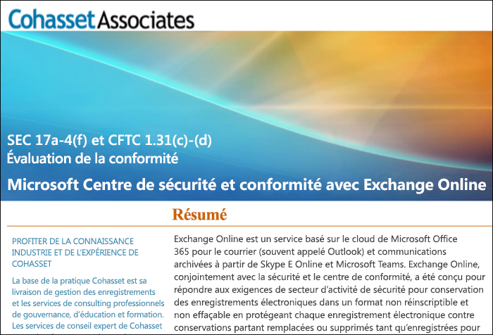

# Utiliser Exchange Online et le centre de sécurité et conformité pour se conformer à la règle SEC 17a-4Use Exchange Online and the Security & Compliance Center to comply with SEC Rule 17a-4

Si votre organisation doit respecter les normes réglementaires pour conserver vos données, le Centre de Conformité et Sécurité Office 365 fournit des fonctionnalités pour gérer le cycle de vie de vos données dans Exchange Online. Cela inclut la possibilité de conserver, d’audit, rechercher et exporter vos données. Ces fonctionnalités sont suffisantes pour répondre aux besoins de la plupart des organisations.If your organization needs to comply with regulatory standards for retaining your data, the Office 365 Security & Compliance Center provides features to manage the lifecycle of your data in Exchange Online. This includes the ability to retain, audit, search, and export your data. These capabilities are sufficient to meet the needs of most organizations.

Toutefois, certaines organisations dans des secteurs hautement réglementés sont soumises à des exigences réglementaires plus stricts. Par exemple, les institutions financières de tels que les banques ou les courtiers sont soumis aux règle 17 a-4 émis par Securities and Exchange Commission (SEC). La Règle 17 a-4 a des exigences spécifiques pour le stockage de données électroniques, y compris de nombreux aspects de la gestion des enregistrements telles que la durée, le format, la qualité, la disponibilité et la responsabilité de rétention des enregistrements.However, some organizations in highly regulated industries are subject to more stringent regulatory requirements. For example, financial institutions such as banks or broker dealers are subject to Rule 17a-4 issued by the Securities and Exchange Commission (SEC). Rule 17a-4 has specific requirements for electronic data storage, including many aspects of record management, such as the duration, format, quality, availability, and accountability of records retention.

Pour aider ces organisations à mieux comprendre comment le Centre de Sécurité et Conformité peut être utilisé pour répondre à leurs obligations légales pour Exchange Online. plus précisément par rapport à la configuration requise relative à la règle 17 a-4, nous avons publié une évaluation en partenariat avec Cohasset Associates.To help these organizations better understand how the Security & Compliance Center can be leveraged to meet their regulatory obligations for Exchange Online, specifically in relation to Rule 17a-4 requirements, we have released an assessment in partnership with Cohasset Associates.

Cohasset a validé que lorsque Exchange Online et le Centre de Sécurité et Conformité sont configurés comme recommandé, ils répondent aux exigences de stockage pertinentes de règle CFTC 1.31(c)-(d), la FINRA règle 4511 et la SEC règle 17 a-4.  Nous avons ciblé cet ensemble de règles car elles représentent les conseils de la plupart des conseils globalement pour la rétention des enregistrements pour les institutions financières.Cohasset validated that when Exchange Online and the Security & Compliance Center are configured as recommended, they meet the relevant storage requirements of CFTC Rule 1.31(c)-(d), FINRA Rule 4511, and SEC Rule 17a-4.  We targeted this set of rules because they represent the most prescriptive guidance globally for records retention for financial institutions.

## Télécharger l’évaluation CohassetDownload the Cohasset assessment

Vous pouvez [télécharger ici l’évaluation Cohasset](https://servicetrust.microsoft.com/ViewPage/TrustDocuments?command=Download&downloadType=Document&downloadId=9fa8349d-a0c9-47d9-93ad-472aa0fa44ec&docTab=6d000410-c9e9-11e7-9a91-892aae8839ad_FAQ_and_White_Papers).You can [download the Cohasset assessment here](https://servicetrust.microsoft.com/ViewPage/TrustDocuments?command=Download&downloadType=Document&downloadId=9fa8349d-a0c9-47d9-93ad-472aa0fa44ec&docTab=6d000410-c9e9-11e7-9a91-892aae8839ad_FAQ_and_White_Papers).

## Cette évaluation est spécifique à Exchange OnlineThis assessment is specific to Exchange Online

Notez que cette évaluation est spécifique à Exchange Online. L’évaluation n’inclut pas les autres services Office 365 tels que SharePoint Online ou OneDrive Entreprise, bien que nous envisageons la prise en charge dans ces services par rapport à SEC 17 a-4 à l’avenir.Note that this assessment is specific to Exchange Online. The assessment does not include other Office 365 services such as SharePoint Online or OneDrive for Business, although we are planning support for those services with respect to SEC 17a-4 in the future.

Il est important de comprendre que Skype Entreprise et Teams stockent également des données dans Exchange Online.  Par conséquent, l’évaluation traite les messages de Skype Entreprise, le canal et les messages de conversation à partir de Teams.It’s important to understand that Skype for Business and Teams also store data in Exchange Online.  Therefore, the assessment does cover messages from Skype for Business and channel and chat messages from Teams.

## À l’aide de verrouillage de conservation est essentiel pour la configuration recommandéeUsing Preservation Lock is key to the recommended configuration

Les secteurs d’activités hautement rigoureuses ont souvent besoin de stocker les communications électroniques afin de répondre à la configuration requise WORM (plusieurs lectures, écriture une seule fois). La configuration requise WORM dicte une solution de stockage dans lequel un enregistrement doit être :Highly regulated industries are often required to store electronic communications to meet the WORM (write once, read many) requirement. The WORM requirement dictates a storage solution in which a record must be:

- Conservée pendant une période de rétention obligatoire qui ne peut pas être raccourcie uniquement augmentée.Retained for a required retention period that cannot be shortened, only increased.
- Immuable, ce qui signifie que l’enregistrement ne peut pas être remplacée, supprimée ou modifiée pendant la période de rétention requise.Immutable, meaning that the record cannot be overwritten, erased, or altered during the required retention period.

Dans Exchange Online, lorsqu’une[stratégie de rétention](retention-policies.md) est appliquée à la boîte aux lettres d’un utilisateur, tout contenu de l’utilisateur sera conservée en fonction de critères de la stratégie. En fait, si un utilisateur tente de supprimer ou modifier un message électronique, une copie du message électronique avant la modification est effectuée et conservée dans un emplacement sécurisé, masqué dans la boîte aux lettres de l’utilisateur. Les stratégies de rétention peuvent vous assurer qu’une organisation conserve les communications électroniques, mais ces stratégies peuvent être modifiées.In Exchange Online, when a [retention policy](retention-policies.md) is applied to a user's mailbox, all of the user's content will be retained based on the criteria of the policy. In fact, if a user attempts to delete or modify an email, a copy of the email before the change is made will be preserved in a secure, hidden location in the user's mailbox. Retention polices can ensure that an organization retains electronic communications, but those policies can be modified.

En plaçant un verrouillage de conservation dans une stratégie de rétention, une organisation garantit que la stratégie ne peut pas être modifiée. En fait, une fois un verrouillage de conservation est appliquée à une stratégie de rétention, les actions suivantes sont limitées :By placing a Preservation Lock on a retention policy, an organization ensures that the policy cannot be modified. In fact, after a Preservation Lock is applied to a retention policy, the following actions are restricted:

- La période de rétention de la stratégie peut uniquement être accrue, elle ne raccourcie pas.The retention period of the policy can only be increased, not shortened.
- Les utilisateurs peuvent être ajoutés à la stratégie, mais aucun utilisateur ne peut être supprimé.Users can be added to the policy, but no user can be removed.
- La stratégie de rétention ne peut pas être supprimée par un administrateur.The retention policy cannot be deleted by an administrator.

Le verrouillage de conservation peut vous aider à répondre aux exigences réglementaires SEC 17 a-4.Preservation Lock can help you meet the SEC 17a-4 regulatory requirements.

## Comment configurer le verrouillage de conservationHow to set up Preservation Lock

Vous pouvez verrouiller une stratégie de rétention à l’aide de PowerShell. Pour plus d’informations, voir [Verrouillage d’une stratégie de rétention](retention-policies.md#locking-a-retention-policy).You can lock a retention policy by using PowerShell. For more information, see [Locking a retention policy](retention-policies.md#locking-a-retention-policy).

## Limitations connuesKnown limitations

Nous sommes conscients de quelques limitations importantes dans Exchange Online. Nous travaillons activement sur celles-ci et prévoyons de publier une prise en charge dans ces scénarios en juillet 2019:We’re aware of a few limitations in Exchange Online. We’re actively working on these and expect to release support for these scenarios in July 2019:

- L’audit au niveau de l’élément n’est pas disponible dans les boîtes aux lettres de groupe Office 365.Item-level auditing is not available in Office 365 Group mailboxes.
- Les fils de communications ne sont pas disponibles pour les messages de conversation et le canal équipes.Threaded communications are not available for Teams chat and channel messages.
- Les mentions j’aime ne sont pas conservées pour les messages de conversation et le canal équipes.Likes are not retained for Teams chat and channel messages.
