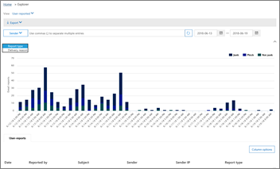

# Utiliser l’Explorateur de solutions de sécurité &amp; centre de conformité

Si votre organisation dispose [d’Informations sur les menaces Office 365](office-365-ti.md)et que vous disposez des [autorisations dans le centre de conformité et de sécurité pour Microsoft Office 365](permissions-in-the-security-and-compliance-center.md)nécessaires, vous pouvez utiliser l’Explorateur de solutions pour identifier et analyser les menaces. Par exemple, vous pouvez identifier et supprimer le courrier électronique malveillant qui a été remis ou voir des programmes malveillants qui a été détectée par les fonctionnalités de sécurité d’Office 365. Explorateur de solutions (également appelé Explorateur menace) est une puissante près de rapports en temps réel de la sécurité &amp; centre de conformité.
  

  
Pour utiliser l’Explorateur de solutions, dans la sécurité &amp; centre de conformité, accédez à la **Gestion des menaces** \> **Explorer**.
      
## Vue d’ensemble de l’Explorateur de solutions

Explorateur de solutions affiche des informations sur soupçonnés d’être anti-programme malveillant dans le message électronique fichiers dans Office 365, ainsi que les menaces de sécurité et autres risques à votre organisation. Lorsque vous ouvrez Explorateur de solutions, l’affichage par défaut montre des détections de programmes malveillants d’antivirus. Explorateur de solutions permettre également afficher sécurité fonctionnalités de protection dans Office 365, notamment des [Liens fiables](atp-safe-links.md) et les [Pièces jointes fiables](atp-safe-attachments.md).
  

  
Pour modifier les informations affichées, utilisez le menu Affichage.
  

  
Explorateur de solutions a plusieurs filtrage et interrogation des fonctionnalités qui vous permettent d’examiner les détails, tels que haut ciblés utilisateurs et familles principaux programmes malveillants. Chaque type de rapport propose de diverses manières pour afficher et Explorer les données, comme décrit dans le tableau suivant.
  
|**Choisissez cette option**|**Pour afficher ces données**|
|:-----|:-----|
|**Courrier électronique** \> **Programmes malveillants**   |Les messages identifiés comme contenant des programmes malveillants.    Afficher des informations dans le graphique à la famille de logiciels malveillants, domaine de l’expéditeur, IP de l’expéditeur, l’état de protection (actions effectuées par vos fonctionnalités de protection des menaces et les stratégies dans Office 365) et technologie de détection (comment le programme malveillant détecté).                 Sous le graphique, afficher les détails des familles principaux programmes malveillants, haut destiné aux utilisateurs et plus d’informations sur des messages spécifiques.    |
|**Courrier électronique** \> **Hameçonnage**   |Les messages identifiés comme les tentatives de hameçonnage.    Afficher des informations à l’état de protection (actions effectuées par vos fonctionnalités de protection des menaces et les stratégies dans Office 365), IP de l’expéditeur et le domaine de l’expéditeur.                 Sous le graphique, permet d’afficher plus d’informations sur des messages spécifiques.    |
|**Courrier électronique** \> **Signalés par les utilisateurs**   |Courrier électronique que les utilisateurs ont signalés comme courrier indésirable, pas indésirable ou hameçonnage.    Afficher les informations par type de rapport (détermination de l’utilisateur que le courrier électronique a été indésirable, pas indésirable ou hameçonnage) et le motif de livraison (raisons pourquoi messagerie est passée à un emplacement spécifique, par exemple une stratégie de filtrage du courrier indésirable, une règle de flux de messagerie, une liste des expéditeurs bloqués, une liste des expéditeurs, etc.).                 Sous le graphique, permet d’afficher plus d’informations sur les e-mails spécifiques, telles que la ligne objet, adresse IP de l’expéditeur, l’utilisateur qui a signalé le message comme indésirable courrier indésirable, ou hameçonnage et non plus.    |
|**Courrier électronique** \> **Tous les messages**   |Une vue de toutes les d’activité de courrier électronique, y compris e-mail identifié comme malveillants en raison de l’hameçonnage ou des programmes malveillants, en tant qu’ainsi tous les messages non malveillantes (messagerie normal, spam et courrier indésirable).    > [!NOTE]> Si vous obtenez une erreur indiquant **trop grande quantité de données afficher**, ajouter un filtre et, si nécessaire, limitez la plage de dates que vous visualisez. Pour appliquer un filtre, choisissez **expéditeur**, sélectionnez un élément dans la liste, puis cliquez sur le bouton d’actualisation. Dans notre exemple, nous avons utilisé la **technologie de détection** comme filtre (il existe plusieurs options disponibles).           Afficher des informations à l’expéditeur, domaine de l’expéditeur, destinataires, subject, nom de fichier de pièce jointe, famille de logiciels malveillants, l’état de protection (actions effectuées par vos fonctionnalités de protection des menaces et les stratégies dans Office 365), technologie de détection (comment le programme malveillant détecté), et plus.               Sous le graphique, permet d’afficher plus d’informations sur les messages de messagerie spécifiques, telles que la ligne objet, destinataire, expéditeur, statut et ainsi de suite.    |
|**Contenu** \> **Programmes malveillants**   |Fichiers qui ont été identifiés comme malveillants dans SharePoint Online, OneDrive pour les entreprises et Teams Microsoft.    Afficher les informations par la technologie de détection famille, de programmes malveillants (comment le programme malveillant détecté) et la charge de travail (SharePoint, OneDrive ou équipes).                 Sous le graphique, permet d’afficher plus d’informations sur les fichiers spécifiques, telles que le nom de fichier de pièce jointe, la charge de travail, la taille de fichier qui a modifié le fichier et bien plus encore.    |
  
## (Nouveau) ! Cliquez sur-filtre de fonctionnalités

Nouveau pour Explorer est la possibilité de cliquer sur pour filtrer. Liaison tardive 2018 mai, lorsque vous cliquez sur un élément dans la légende, à partir de cet élément devienne un filtre pour le rapport. Par exemple, supposons que nous cherchons à l’affichage de programmes malveillants dans l’Explorateur de solutions :
  

  
En cliquant sur **DAV détonation** dans les résultats de ce graphique dans un affichage semblable à celle-ci : 
  

  
Dans cet affichage, nous recherchons maintenant au niveau des données pour les fichiers qui ont été detonated par [Office 365 DAV approuvés en pièce jointe](atp-safe-attachments.md). Sous le graphique, nous pouvons voir plus d’informations sur les messages électroniques spécifiques qui avaient des pièces jointes qui ont été détectés par les pièces jointes sûres DAV.
  

  
Sélection d’un ou plusieurs éléments Active le menu **Actions** , ce qui offre plusieurs options parmi lesquelles choisir pour les éléments sélectionnés. 
  

  
La possibilité de filtrer en un clic et accédez à des détails spécifiques permettre enregistrer beaucoup de temps dans l’analyse des menaces.
  
## Comment obtenir de l’Explorateur de solutions ?

Explorer est inclus dans [Office 365 menaces](office-365-ti.md). Vous devez avoir appropriée [les autorisations attribuées dans le centre de conformité et de sécurité pour Microsoft Office 365](permissions-in-the-security-and-compliance-center.md), tels que l’administrateur de sécurité ou lecteur de sécurité, afin d’afficher et utiliser l’Explorateur de solutions.
  
## Voir aussi

[Rapports et vues d’ensemble de sécurité Office 365 &amp; centre de conformité](reports-and-insights-in-security-and-compliance.md)
  
[Rechercher et vérifier le courrier électronique malveillant qui a été remis (Office 365 Threat Intelligence)](investigate-malicious-email-that-was-delivered.md)
  
[Protection contre le courrier indésirable et les programmes malveillants dans Office 365](anti-spam-and-anti-malware-protection.md)
  

