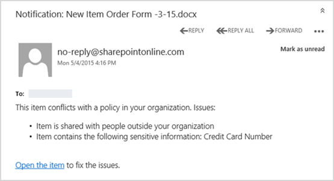
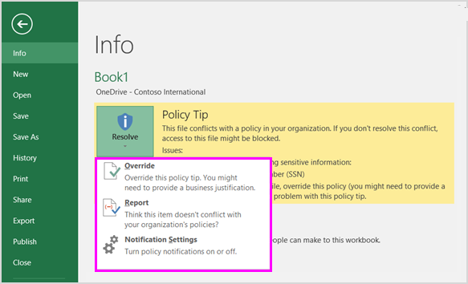

# Envoyer des notifications par courrier électronique et afficher les conseils de stratégie pour les stratégies DLPSend email notifications and show policy tips for DLP policies

Vous pouvez utiliser une stratégie de protection contre la perte données pour identifier, analyser et protection des informations sensibles dans Office 365. Vous souhaitez que les personnes de votre organisation qui travaillent avec ces informations sensibles restent conformes à vos stratégies DLP, mais vous ne voulez pas empêcher les inutilement effectuer leur travail. Il s’agit où les notifications par courrier électronique et les conseils de stratégie peuvent aider.You can use a data loss prevention (DLP) policy to identify, monitor, and protect sensitive information across Office 365. You want people in your organization who work with this sensitive information to stay compliant with your DLP policies, but you don't want to block them unnecessarily from getting their work done. This is where email notifications and policy tips can help.
  

  
Un Conseil de stratégie est une notification ou avertissement qui s’affiche lorsqu’une personne fonctionne avec le contenu qui est en conflit avec une stratégie DLP — par exemple, de contenu comme un classeur Excel sur un site d’entreprise qui contient des informations d’identification personnelle (PII) et est OneDrive partagé avec un utilisateur externe.A policy tip is a notification or warning that appears when someone is working with content that conflicts with a DLP policy—for example, content like an Excel workbook on a OneDrive for Business site that contains personally identifiable information (PII) and is shared with an external user.
  
Vous pouvez utiliser les notifications par courrier électronique et les conseils de stratégie pour sensibiliser et aider à former les utilisateurs sur les stratégies de votre organisation. Vous pouvez également permettent d’être affichées aux personnes cette option pour remplacer la stratégie, afin qu’ils ne sont pas bloqués s’ils disposent d’une entreprise valide ou si la stratégie détecte un faux positif.You can use email notifications and policy tips to increase awareness and help educate people about your organization's policies. You can also give people the option to override the policy, so that they're not blocked if they have a valid business need or if the policy is detecting a false positive.
  
De sécurité Office 365 &amp; centre de conformité, lorsque vous créez une stratégie DLP, vous pouvez configurer les notifications de l’utilisateur à :In the Office 365 Security &amp; Compliance Center, when you create a DLP policy, you can configure the user notifications to:
  
- Envoyer une notification par courrier électronique aux personnes vous choisissez qui décrit le problème.Send an email notification to the people you choose that describes the issue.
    
- Afficher un Conseil de stratégie pour le contenu qui est en conflit avec la stratégie DLP :Display a policy tip for content that conflicts with the DLP policy:
    
  - Pour le courrier électronique dans Outlook sur le web et d’Outlook 2013 et versions ultérieures, le Conseil de stratégie s’affiche en haut d’un message au-dessus de destinataires pendant que le message est en cours composé.For email in Outlook on the web and Outlook 2013 and later, the policy tip appears at the top of a message above the recipients while the message is being composed.
    
  - Pour les documents dans un compte professionnel ou un site SharePoint Online OneDrive, le Conseil de stratégie est indiqué par une icône d’avertissement qui s’affiche sur l’élément. Pour afficher plus d’informations, vous pouvez sélectionner un élément et puis cliquez sur **informations** dans le coin supérieur droit de la page pour ouvrir le volet d’informations.For documents in a OneDrive for Business account or SharePoint Online site, the policy tip is indicated by a warning icon that appears on the item. To view more information, you can select an item and then choose **Information** in the upper-right corner of the page to open the details pane. 
    
  - Pour Excel 2016, 2016 PowerPoint et des documents Word 2016 qui sont stockés sur un site de l’entreprise ou un site SharePoint Online qui est inclus dans la stratégie DLP OneDrive, le Conseil de stratégie apparaît dans la barre des messages et le mode Backstage (menu **fichier** \> \*\* Info\*\*).For Excel 2016, PowerPoint 2016, and Word 2016 documents that are stored on a OneDrive for Business site or SharePoint Online site that's included in the DLP policy, the policy tip appears on the Message Bar and the Backstage view ( **File** menu \> **Info**).
    
## Ajouter des notifications de l’utilisateur à une stratégie DLPAdd user notifications to a DLP policy

Lorsque vous créez une stratégie DLP, les notifications par courrier électronique et les conseils de stratégie sont une partie de la section **notifications de l’utilisateur** .When you create a DLP policy, both email notifications and policy tips are part of the **User notifications** section. 
  
1. Accédez à [https://protection.office.com](https://protection.office.com).Go to [https://protection.office.com](https://protection.office.com).
    
2. Connectez-vous à Office 365 à l’aide de votre compte professionnel ou de l’école. Vous êtes maintenant dans la sécurité Office 365 &amp; centre de conformité.Sign in to Office 365 using your work or school account. You're now in the Office 365 Security &amp; Compliance Center.
    
3. Dans la sécurité &amp; centre de conformité \> barre de navigation gauche \> **prévention des pertes de données** \> **stratégie** \> **+ créer une stratégie**.In the Security &amp; Compliance Center \> left navigation \> **Data loss prevention** \> **Policy** \> **+ Create a policy**.
    
    
  
4. Choisissez le modèle de stratégie DLP qui protège les types d’informations sensibles que vous devez \> **suivant**.Choose the DLP policy template that protects the types of sensitive information that you need \> **Next**.
    
    Pour démarrer avec un modèle vide, sélectionnez **personnalisé** \> **stratégie personnalisée** \> **suivant**.To start with an empty template, choose **Custom** \> **Custom policy** \> **Next**.
    
5. Nom de la stratégie \> **suivant**.Name the policy \> **Next**.
    
6. Pour choisir les emplacements que vous voulez que la stratégie DLP protéger, effectuez l’une des opérations suivantes :To choose the locations that you want the DLP policy to protect, do one of the following:
    
  - Choisissez **tous les emplacements dans Office 365** \> **suivant**.Choose **All locations in Office 365** \> **Next**.
    
  - Sélectionnez **me laisser choisir les emplacements spécifiques** \> **suivant**.Choose **Let me choose specific locations** \> **Next**.
    
    Pour inclure ou exclure un emplacement complet tel que tout le courrier Exchange ou tous les comptes de OneDrive, activer ou désactiver la l' **état** de cet emplacement.To include or exclude an entire location such as all Exchange email or all OneDrive accounts, switch the **Status** of that location on or off. 
    
    Pour inclure uniquement certains sites SharePoint ou les comptes de OneDrive, changer l' **état** , puis cliquez sur les liens sous **inclure** à choisir des comptes ou des sites spécifiques.To include only specific SharePoint sites or OneDrive accounts, switch the **Status** to on, and then click the links under **Include** to choose specific sites or accounts. 
    
7. Choisissez **d’utiliser les paramètres avancés** \> **suivant**.Choose **Use advanced settings** \> **Next**.
    
8. Choisissez **+ nouvelle règle**.Choose **+ New rule**.
    
9. Dans l’éditeur de règle, sous **notifications utilisateur**, basculez le statut.In the rule editor, under **User notifications**, switch the status on.
    
    
  
## Options de configuration des notifications par courrier électroniqueOptions for configuring email notifications

Pour chaque règle d’une stratégie DLP, vous pouvez :For each rule in a DLP policy, you can:
  
- Envoyer la notification aux personnes de votre choix. Celles-ci peuvent inclure le propriétaire du contenu, la personne qui a modifié le contenu en dernier, le propriétaire du site sur lequel est stocké le contenu ou un utilisateur spécifique.Send the notification to the people you choose. These people can include the owner of the content, the person who last modified the content, the owner of the site where the content is stored, or a specific user.
    
- Personnaliser le texte qui est inclus dans la notification à l’aide de code HTML ou les jetons. Voir la section ci-dessous pour plus d’informations.Customize the text that's included in the notification by using HTML or tokens. See the section below for more information.
    
> [!NOTE]
>  Notifications par courrier électronique peuvent être envoyées uniquement à des destinataires — pas les groupes ou les listes de distribution. > seul le nouveau contenu déclenche une notification par courrier électronique. Modification de contenu existant déclenche les conseils de stratégie, mais pas une notification par courrier électronique.Email notifications can be sent only to individual recipients—not groups or distribution lists. >  Only new content will trigger an email notification. Editing existing content will trigger policy tips but not an email notification. 
  

  
### Notification par courrier électronique par défautDefault email notification

Notifications ont une ligne d’objet commence par l’action effectuée, tel que « Notification », « Message bloqué » pour le courrier électronique, ou « Accès bloqué » pour les documents. Si la notification est sur un document, le corps du message de notification inclut un lien qui vous dirige vers le site où le document de stockées et ouvre le Conseil de stratégie pour le document, où vous pouvez résoudre les problèmes (voir la section ci-dessous sur les conseils de stratégie). Si la notification est sur un message, la notification inclut en pièce jointe le message qui correspond à une stratégie DLP.Notifications have a Subject line that begins with the action taken, such as "Notification", "Message Blocked" for email, or "Access Blocked" for documents. If the notification is about a document, the notification message body includes a link that takes you to the site where the document's stored and opens the policy tip for the document, where you can resolve any issues (see the section below about policy tips). If the notification is about a message, the notification includes as an attachment the message that matches a DLP policy.
  

  
Par défaut, les notifications affichent un texte semblable au suivant pour un élément sur un site. Le texte des notifications est configuré séparément pour chaque règle, afin que le texte qui s’affiche varie en fonction de la règle mise en correspondance.By default, notifications display text similar to the following for an item on a site. The notification text is configured separately for each rule, so the text that's displayed differs depending on which rule is matched.

|**Si la règle de stratégie DLP...****If the DLP policy rule does this…**|**Puis la notification par défaut pour SharePoint ou OneDrive pour les documents d’entreprise indique ceci...****Then the default notification for SharePoint or OneDrive for Business documents says this…**|**Puis la notification par défaut pour les messages Outlook indique que ceci...****Then the default notification for Outlook messages says this…**|
|:-----|:-----|:-----|
|Envoie une notification, mais ne permet pas de substitutionSends a notification but doesn't allow override    |Cet élément est en conflit avec une stratégie de votre organisation.This item conflicts with a policy in your organization.    |Votre courrier électronique message est en conflit avec une stratégie de votre organisation.Your email message conflicts with a policy in your organization.    |
|Bloque l’accès, envoie une notification et autorise le remplacementBlocks access, sends a notification, and allows override    |Cet élément est en conflit avec une stratégie de votre organisation. Si vous ne pas résoudre le conflit, accéder à ce fichier peut être bloqué.This item conflicts with a policy in your organization. If you don't resolve this conflict, access to this file might be blocked.    |Votre courrier électronique message est en conflit avec une stratégie de votre organisation. Le message n’a pas été remis à tous les destinataires.Your email message conflicts with a policy in your organization. The message wasn't delivered to all recipients.    |
|Bloque l’accès et envoie une notificationBlocks access and sends a notification    |Cet élément est en conflit avec une stratégie de votre organisation. L’accès à cet élément est bloqué pour tous les utilisateurs, à l’exception de son propriétaire, de l’utilisateur ayant effectué la dernière modification et l’administrateur de la collection de sites principale.This item conflicts with a policy in your organization. Access to this item is blocked for everyone except its owner, last modifier, and the primary site collection administrator.    |Votre courrier électronique message est en conflit avec une stratégie de votre organisation. Le message n’a pas été remis à tous les destinataires.Your email message conflicts with a policy in your organization. The message wasn't delivered to all recipients.    |
   
### Notification de message électronique personnaliséCustom email notification

Vous pouvez créer une notification de message électronique personnalisé au lieu d’envoyer la notification par courrier électronique par défaut pour vos utilisateurs finaux ou les administrateurs. La notification de message électronique personnalisé prend en charge HTML et a une limite de 5 000 caractères. Vous pouvez utiliser le HTML pour inclure des images, la mise en forme et les autres marques dans la notification.You can create a custom email notification instead of sending the default email notification to your end users or admins. The custom email notification supports HTML and has a 5,000-character limit. You can use HTML to include images, formatting, and other branding in the notification.
  
Vous pouvez également utiliser les jetons suivants vous aideront à personnaliser la notification par courrier électronique. Ces jetons sont des variables qui sont remplacés par des informations spécifiques dans la notification est envoyée.You can also use the following tokens to help customize the email notification. These tokens are variables that are replaced by specific information in the notification that's sent.

|**Émission de jeton****Token**|**Description****Description**|
|:-----|:-----|
|%% AppliedActions %%%%AppliedActions%%    |Les actions appliquées au contenu.The actions applied to the content.    |
|%% ContentURL %%%%ContentURL%%    |L’URL du document sur le site SharePoint Online ou OneDrive pour le site de l’entreprise.The URL of the document on the SharePoint Online site or OneDrive for Business site.    |
|%% MatchedConditions %%%%MatchedConditions%%    |Les conditions qui ont été filtrées par le contenu. Utilisez ce jeton pour informer les utilisateurs des problèmes possibles avec le contenu.The conditions that were matched by the content. Use this token to inform people of possible issues with the content.    |
   

  
## Options de configuration des conseils de stratégieOptions for configuring policy tips

Pour chaque règle d’une stratégie DLP, vous pouvez configurer des conseils de stratégie pour :For each rule in a DLP policy, you can configure policy tips to:
  
- Simplement notifier la personne que le contenu est en conflit avec une stratégie DLP, afin qu’ils peuvent prendre des mesures pour résoudre le conflit. Vous pouvez utiliser le texte par défaut (voir les tableaux ci-dessous) ou entrez le texte personnalisé sur les stratégies spécifiques de votre organisation.Simply notify the person that the content conflicts with a DLP policy, so that they can take action to resolve the conflict. You can use the default text (see the tables below) or enter custom text about your organization's specific policies.
    
- Autoriser la personne à remplacer la stratégie DLP. Si vous le souhaitez, vous pouvez :Allow the person to override the DLP policy. Optionally, you can:
    
  - Exiger de la personne à entrer une justification du remplacement de la stratégie. Cette information est enregistrée et vous pouvez l’afficher dans les rapports DLP dans la section **rapports** de la sécurité &amp; centre de conformité.Require the person to enter a business justification for overriding the policy. This information is logged and you can view it in the DLP reports in the **Reports** section of the Security &amp; Compliance Center. 
    
  - Autoriser la personne à signaler un faux positif et remplacer la stratégie DLP. Cette information est également journalisée pour la création de rapports, afin que vous puissiez utiliser les faux positifs pour affiner vos règles.Allow the person to report a false positive and override the DLP policy. This information is also logged for reporting, so that you can use false positives to fine tune your rules.
    

  
Par exemple, avoir une stratégie DLP appliquée à OneDrive pour les sites qui détecte les informations d’identification personnelle (PII), et cette stratégie a trois règles :For example, you may have a DLP policy applied to OneDrive for Business sites that detects personally identifiable information (PII), and this policy has three rules:
  
1. Première règle : si moins de cinq instances de ces informations sensibles sont détectées dans un document et que le document est partagé avec des personnes au sein de l’organisation, l’action **Envoyer une notification** affiche un conseil de stratégie. Pour les conseils de stratégie, aucune option de remplacement n’est nécessaire car cette règle avertit simplement les utilisateurs et ne bloque pas l’accès.First rule: If fewer than five instances of this sensitive information are detected in a document, and the document is shared with people inside the organization, the **Send a notification** action displays a policy tip. For policy tips, no override options are necessary because this rule is simply notifying people and not blocking access. 
    
2. Seconde règle : si elle est supérieure à cinq instances de ces informations sensibles détectés dans un document et le document est partagé avec des personnes à l’intérieur de l’organisation, l’action **Bloquer l’accès au contenu** restreint les autorisations pour le fichier et le \*\* Envoyer une notification\*\* action permet aux utilisateurs de remplacer les actions de cette règle en fournissant une justification. Entreprise de votre organisation requiert parfois des personnes internes de partager des données personnelles, et vous ne voulez pas que votre stratégie DLP pour bloquer ce travail.Second rule: If greater than five instances of this sensitive information are detected in a document, and the document is shared with people inside the organization, the **Block access to content** action restricts the permissions for the file, and the **Send a notification** action allows people to override the actions in this rule by providing a business justification. Your organization's business sometimes requires internal people to share PII data, and you don't want your DLP policy to block this work. 
    
3. Troisième règle : Si plus de cinq instances de ces informations sensibles sont détectées dans un document et que le document est partagé avec des personnes extérieures à l’organisation, l’action **Bloquer l’accès au contenu** restreint les autorisations pour le fichier et l’action **Envoyer une notification** ne permet pas aux utilisateurs de remplacer les actions de cette règle car les informations sont partagées en externe. En aucun cas les membres de votre organisation ne doivent être autorisés à partager des données PII en dehors de l’organisation.Third rule: If greater than five instances of this sensitive information are detected in a document, and the document is shared with people outside the organization, the **Block access to content** action restricts the permissions for the file, and the **Send a notification** action does not allow people to override the actions in this rule because the information is shared externally. Under no circumstances should people in your organization be allowed to share PII data outside the organization. 
    
Voici quelques notions précises à comprendre à propos de l’utilisation d’un conseil de stratégie pour remplacer une règle :Here are some fine points to understand about using a policy tip to override a rule:
  
- Cette option pour remplacer est par la règle, et il remplace toutes les actions de la règle (à l’exception de l’envoi d’une notification, qui ne peut pas être substituée).The option to override is per rule, and it overrides all of the actions in the rule (except sending a notification, which can't be overridden).
    
- Il est possible de contenu pour la correspondance de plusieurs règles dans une stratégie DLP, mais s’affichera uniquement le Conseil de stratégie à partir de la plus restrictive, la priorité de la règle. Par exemple, un Conseil de stratégie à partir d’une règle qui bloque l’accès au contenu s’affichera sur un Conseil de stratégie à partir d’une règle qui envoie une notification. Cela empêche des personnes de voir une cascade de conseils de stratégie.It's possible for content to match several rules in a DLP policy, but only the policy tip from the most restrictive, highest-priority rule will be shown. For example, a policy tip from a rule that blocks access to content will be shown over a policy tip from a rule that simply sends a notification. This prevents people from seeing a cascade of policy tips.
    
- Si les conseils de stratégie de la règle la plus restrictive autorisent les utilisateurs à remplacer la règle, toute autre règle également mise en correspondance avec le contenu est aussi remplacée.If the policy tips in the most restrictive rule allow people to override the rule, then overriding this rule also overrides any other rules that the content matched.
    
## Conseils de stratégie sur les sites OneDrive Entreprise et les sites SharePoint OnlinePolicy tips on OneDrive for Business sites and SharePoint Online sites

Lorsqu’un document sur un site de l’entreprise ou un site SharePoint Online OneDrive correspond à une règle dans une stratégie DLP, et cette règle utilise les conseils de stratégie, les conseils de stratégie affichent les icônes spéciales sur le document :When a document on a OneDrive for Business site or SharePoint Online site matches a rule in a DLP policy, and that rule uses policy tips, the policy tips display special icons on the document:
  
1. Si la règle envoie une notification sur le fichier, l’icône d’avertissement s’affiche.If the rule sends a notification about the file, the warning icon appears.
    
2. Si la règle bloque l’accès au document, l’icône de blocage s’affiche.If the rule blocks access to the document, the blocked icon appears.
    

  
Pour effectuer une action sur un document, vous pouvez sélectionner un élément \> choisissez **informations** dans le coin supérieur droit de la page pour ouvrir le volet d’informations \> **Conseil de stratégie d’affichage**.To take action on a document, you can select an item \> choose **Information** in the upper-right corner of the page to open the details pane \> **View policy tip**.
  
Le conseil de stratégie répertorie les problèmes rencontrés avec le contenu, et s’ils sont configurés avec ces options, vous pouvez choisir de les **résoudre**, puis de **remplacer** le conseil de stratégie ou de **signaler** un faux positif.The policy tip lists the issues with the content, and if the policy tips are configured with these options, you can choose **Resolve**, and then **Override** the policy tip or **Report** a false positive. 
  

  

  
Les stratégies DLP sont synchronisées avec les sites et le contenu est évalué par rapport à ces stratégies régulièrement et de manière asynchrone. Vous pouvez donc constater un bref délai entre le moment de la création de la stratégie DLP et celui où vous commencez à voir les conseils de stratégie. Un délai similaire peut exister entre le moment où vous résolvez ou remplacez un conseil de stratégie et celui où l’icône disparaît pour le document sur le site.DLP policies are synced to sites and contented is evaluated against them periodically and asynchronously, so there may be a short delay between the time you create the DLP policy and the time you begin to see policy tips. There may be a similar delay from when you resolve or override a policy tip to when the icon on the document on the site goes away.
  
### Texte par défaut pour les conseils de stratégie sur les sitesDefault text for policy tips on sites

Par défaut, les conseils de stratégie affichent un texte semblable à ce qui suit pour un élément sur un site. Le texte des notifications est configuré séparément pour chaque règle, afin que le texte qui s’affiche varie en fonction de la règle mise en correspondance.By default, policy tips display text similar to the following for an item on a site. The notification text is configured separately for each rule, so the text that's displayed differs depending on which rule is matched.

|**Si la règle de stratégie DLP...****If the DLP policy rule does this…**|**Le conseil de stratégie par défaut indique que...****Then the default policy tip says this…**|
|:-----|:-----|
|Envoie une notification, mais ne permet pas de substitutionSends a notification but doesn't allow override    |Cet élément est en conflit avec une stratégie de votre organisation.This item conflicts with a policy in your organization.    |
|Bloque l’accès, envoie une notification et autorise le remplacementBlocks access, sends a notification, and allows override    |Cet élément est en conflit avec une stratégie de votre organisation. Si vous ne pas résoudre le conflit, accéder à ce fichier peut être bloqué.This item conflicts with a policy in your organization. If you don't resolve this conflict, access to this file might be blocked.    |
|Bloque l’accès et envoie une notificationBlocks access and sends a notification    |Cet élément est en conflit avec une stratégie de votre organisation. L’accès à cet élément est bloqué pour tous les utilisateurs, à l’exception de son propriétaire, de l’utilisateur ayant effectué la dernière modification et l’administrateur de la collection de sites principale.This item conflicts with a policy in your organization. Access to this item is blocked for everyone except its owner, last modifier, and the primary site collection administrator.    |
   
### Texte personnalisé pour des conseils de stratégie sur les sitesCustom text for policy tips on sites

Vous pouvez personnaliser le texte de conseils de stratégie séparément à partir de la notification par courrier électronique. Contrairement à un texte personnalisé pour les notifications par courrier électronique (voir ci-dessus section), un texte personnalisé pour les conseils de stratégie n’accepte pas HTML ou les jetons. Au lieu de cela, le texte personnalisé pour des conseils de stratégie est en texte brut uniquement avec une limite de 256 caractères.You can customize the text for policy tips separately from the email notification. Unlike custom text for email notifications (see above section), custom text for policy tips does not accept HTML or tokens. Instead, custom text for policy tips is plain text only with a 256-character limit.
  
## Conseils de stratégie dans Outlook sur le web et Outlook 2013 et versions ultérieuresPolicy tips in Outlook on the web and Outlook 2013 and later

Lorsque vous composez un nouveau message électronique dans Outlook sur le web et Outlook 2013 et versions ultérieures, vous verrez un Conseil de stratégie si vous ajoutez le contenu qui correspond à une règle dans une stratégie DLP, et cette règle utilise les conseils de stratégie. Le Conseil de stratégie s’affiche en haut du message, au-dessus de destinataires, tandis que le message est en cours composé.When you compose a new email in Outlook on the web and Outlook 2013 and later, you'll see a policy tip if you add content that matches a rule in a DLP policy, and that rule uses policy tips. The policy tip appears at the top of the message, above the recipients, while the message is being composed.
  

  
Les conseils de stratégie de travail si les informations sensibles apparaissent dans le corps du message, ligne d’objet ou encore une pièce jointe du message, comme indiqué ici.Policy tips work whether the sensitive information appears in the message body, subject line, or even a message attachment as shown here.
  

  
Si les conseils de stratégie sont configurés pour autoriser le remplacement, vous pouvez choisir **d’Afficher les détails** \> **Remplacer** \> permet d’entrer une justification ou signaler un faux positif \> **Remplacer**.If the policy tips are configured to allow override, you can choose **Show Details** \> **Override** \> enter a business justification or report a false positive \> **Override**.
  

  

  
Notez que lorsque vous ajoutez des informations sensibles à un message électronique, il peut y avoir latence entre lors de l’ajout des informations sensibles et lorsque le Conseil de stratégie s’affiche.Note that when you add sensitive information to an email, there may be latency between when the sensitive information is added and when the policy tip appears.

### Outlook 2013 et versions ultérieures prend en charge affichant les conseils de stratégie pour uniquement certaines conditionsOutlook 2013 and later supports showing policy tips for only some conditions

Actuellement, Outlook 2013 et versions ultérieures prend en charge affichant les conseils de stratégie uniquement pour les conditions suivantes :Currently, Outlook 2013 and later supports showing policy tips only for these conditions:

- Contient le contenuContent contains
- Le contenu est partagéContent is shared

Nous sommes actuellement en train de prise en charge pour l’affichage des conseils de stratégie pour des conditions supplémentaires. Cela inclut :We're currently working on support for showing policy tips for additional conditions. These include:

- Contenu de pièce jointe électronique n’a pas pu être analysé.Any email attachment's content could not be scanned
- Contenu de pièce jointe électronique n’a pas terminé l’analyseAny email attachment's content didn't complete scanning
- Extension de fichier des pièces jointesAttachment file extension is
- Pièce jointe est protégé par mot de passeAttachment is password protected
- Propriété de document estDocument property is
- Domaine du destinataire estRecipient domain is
- Adresse IP de l’expéditeur estSender IP address is

Notez que toutes les conditions suivantes fonctionnent dans Outlook, où ils correspondent au contenu et appliquer les mesures de protection du contenu. Mais affichant les conseils de stratégie aux utilisateurs n'est pas encore pris en charge.Note that all of these conditions work in Outlook, where they will match content and enforce protective actions on content. But showing policy tips to users is not yet supported.
  
### Conseils de stratégie dans le centre d’administration Exchange et la sécurité de 365 Office &amp; centre de conformitéPolicy tips in the Exchange Admin Center vs. the Office 365 Security &amp; Compliance Center

Conseils de stratégie peuvent travailler avec les stratégies DLP et créés dans le centre d’administration Exchange, ou avec des stratégies DLP créées de sécurité Office 365 des règles de flux de messagerie &amp; centre de conformité, mais pas les deux. Il s’agit, car ces stratégies sont stockées dans des emplacements différents, mais les conseils de stratégie peuvent tracer uniquement à partir d’un seul emplacement.Policy tips can work either with DLP policies and mail flow rules created in the Exchange Admin Center, or with DLP policies created in the Office 365 Security &amp; Compliance Center, but not both. This is because these policies are stored in different locations, but policy tips can draw only from a single location.
  
Si vous avez configuré les conseils de stratégie dans le centre d’administration Exchange, les conseils de stratégie que vous configurez de sécurité Office 365 &amp; centre de conformité n’apparaîtra pas aux utilisateurs dans Outlook sur le web et Outlook 2013 et versions ultérieures jusqu'à ce que vous désactiviez les conseils fournis dans la version d’Exchange Centre d’administration. Cela garantit que vos règles de transport Exchange en cours continue à fonctionner jusqu'à ce que vous choisissez de basculer vers le Office 365 Security &amp; centre de conformité.If you've configured policy tips in the Exchange Admin Center, any policy tips that you configure in the Office 365 Security &amp; Compliance Center won't appear to users in Outlook on the web and Outlook 2013 and later until you turn off the tips in the Exchange Admin Center. This ensures that your current Exchange transport rules will continue to work until you choose to switch over to the Office 365 Security &amp; Compliance Center.
  
Notez que les notifications de messagerie pendant que les conseils de stratégie peuvent tracer uniquement à partir d’un seul emplacement, sont toujours envoyés, même si vous utilisez des stratégies DLP dans Office 365 Security &amp; centre de conformité et le centre d’administration Exchange.Note that while policy tips can draw only from a single location, email notifications are always sent, even if you're using DLP policies in both the Office 365 Security &amp; Compliance Center and the Exchange Admin Center.
  
### Texte par défaut pour les conseils de stratégie dans le message électroniqueDefault text for policy tips in email

Par défaut, les conseils de stratégie affichent du texte semblable au suivant pour le courrier électronique.By default, policy tips display text similar to the following for email.

|**Si la règle de stratégie DLP...****If the DLP policy rule does this…**|**Le conseil de stratégie par défaut indique que...****Then the default policy tip says this…**|
|:-----|:-----|
|Envoie une notification, mais ne permet pas de substitutionSends a notification but doesn't allow override    |Votre courrier électronique en conflit avec une stratégie de votre organisation.Your email conflicts with a policy in your organization.    |
|Bloque l’accès, envoie une notification et autorise le remplacementBlocks access, sends a notification, and allows override    |Votre courrier électronique en conflit avec une stratégie de votre organisation.Your email conflicts with a policy in your organization.    |
|Bloque l’accès et envoie une notificationBlocks access and sends a notification    |Votre courrier électronique en conflit avec une stratégie de votre organisation.Your email conflicts with a policy in your organization.    |
   
## Conseils de stratégie dans Excel 2016, PowerPoint 2016 et Word 2016Policy tips in Excel 2016, PowerPoint 2016, and Word 2016

Lorsque les utilisateurs travaillent avec du contenu sensible dans les versions de bureau d’Excel 2016, de PowerPoint 2016 et de Word 2016, les conseils de stratégie peuvent les avertir en temps réel que le contenu est en conflit avec une stratégie DLP. En voici les implications :When people work with sensitive content in the desktop versions of Excel 2016, PowerPoint 2016, and Word 2016, policy tips can notify them in real time that the content conflicts with a DLP policy. This requires that:
  
- Le document Office est stocké sur un site OneDrive Entreprise ou un site SharePoint Online.The Office document is stored on a OneDrive for Business site or SharePoint Online site.
    
- Le site est inclus dans une stratégie DLP qui est configurée pour utiliser les conseils de stratégie.The site is included in a DLP policy that's configured to use policy tips.
    
Ces applications bureautiques Office 2016 synchroniser automatiquement les stratégies DLP directement à partir d’Office 365 et d’analyser vos documents pour vous assurer qu’ils ne sont en conflit avec vos stratégies DLP et afficher des conseils de stratégie en temps réel.These Office 2016 desktop programs automatically sync DLP policies directly from Office 365, and then scan your documents to ensure that they don't conflict with your DLP policies and display policy tips in real time.
  
Selon la façon dont vous configurez les conseils de stratégie dans la stratégie DLP, les utilisateurs peuvent choisir d’ignorer simplement le conseil, de remplacer la stratégie avec ou sans justification ou de signaler un faux positif.Depending on how you configure the policy tips in the DLP policy, people can choose to simply ignore the policy tip, override the policy with or without a business justification, or report a false positive.
  
Les conseils de stratégie apparaissent dans la barre des messages.Policy tips appear on the Message Bar.
  

  
Ils apparaissent également dans le mode Backstage (dans l’onglet **Fichier**).And policy tips also appear in the Backstage view (on the **File** tab). 
  

  
Si les conseils de stratégie dans la stratégie DLP sont configurés avec ces options, vous pouvez choisir de **résoudre** le problème pour **remplacer** un conseil de stratégie ou de **signaler** un faux positif.If policy tips in the DLP policy are configured with these options, you can choose **Resolve** to **Override** a policy tip or **Report** a false positive. 
  

  
Dans chacun de ces programmes de bureau Office 2016, les utilisateurs peuvent choisir de désactiver les conseils de stratégie. Si tel est le cas, les conseils qui sont de simples notifications ne s’affichent pas dans la barre des messages ou le mode Backstage (sur l’onglet **Fichier**). Cependant, les conseils de stratégie sur le blocage et le remplacement apparaissent toujours et la notification par courrier électronique est toujours envoyée. Par ailleurs, la désactivation des conseils de stratégie ne dispense pas le document des stratégies DLP qui lui ont été appliquées.In each of these Office 2016 desktop programs, people can choose to turn off policy tips. If turned off, policy tips that are simple notifications will not appear on the Message Bar or Backstage view (on the **File** tab). However, policy tips about blocking and overriding will still appear, and they will still receive the email notification. In addition, turning off policy tips does not exempt the document from any DLP policies that have been applied to it. 
  
### Texte par défaut pour les conseils de stratégie dans Excel 2016, PowerPoint 2016 et Word 2016Default text for policy tips in Excel 2016, PowerPoint 2016, and Word 2016

Par défaut, les conseils de stratégie affichent un texte semblable à ce qui suit sur la barre des messages et le mode Backstage d’un document ouvert. Le texte des notifications est configuré séparément pour chaque règle, afin que le texte qui s’affiche varie en fonction de la règle mise en correspondance.By default, policy tips display text similar to the following on the Message Bar and Backstage view of an open document. The notification text is configured separately for each rule, so the text that's displayed differs depending on which rule is matched.

|**Si la règle de stratégie DLP...****If the DLP policy rule does this…**|**Le conseil de stratégie par défaut indique que...****Then the default policy tip says this…**|
|:-----|:-----|
|Envoie une notification, mais ne permet pas de substitutionSends a notification but doesn't allow override    |Ce fichier est en conflit avec une stratégie de votre organisation. Ouvrez le menu **fichier** pour plus d’informations.This file conflicts with a policy in your organization. Go to the **File** menu for more information.    |
|Bloque l’accès, envoie une notification et autorise le remplacementBlocks access, sends a notification, and allows override    |Ce fichier est en conflit avec une stratégie de votre organisation. Si vous ne pas résoudre le conflit, accéder à ce fichier peut être bloqué. Ouvrez le menu **fichier** pour plus d’informations.This file conflicts with a policy in your organization. If you don't resolve this conflict, access to this file might be blocked. Go to the **File** menu for more information.    |
|Bloque l’accès et envoie une notificationBlocks access and sends a notification    |Ce fichier est en conflit avec une stratégie de votre organisation. Si vous ne pas résoudre le conflit, accéder à ce fichier peut être bloqué. Ouvrez le menu **fichier** pour plus d’informations.This file conflicts with a policy in your organization. If you don't resolve this conflict, access to this file might be blocked. Go to the **File** menu for more information.    |
   
### Conseils de texte personnalisé pour la stratégie dans Excel 2016, 2016 PowerPoint et Word 2016Custom text for policy tips in Excel 2016, PowerPoint 2016, and Word 2016

Vous pouvez personnaliser le texte de conseils de stratégie séparément à partir de la notification par courrier électronique. Contrairement à un texte personnalisé pour les notifications par courrier électronique (voir ci-dessus section), un texte personnalisé pour les conseils de stratégie n’accepte pas HTML ou les jetons. Au lieu de cela, le texte personnalisé pour des conseils de stratégie est en texte brut uniquement avec une limite de 256 caractères.You can customize the text for policy tips separately from the email notification. Unlike custom text for email notifications (see above section), custom text for policy tips does not accept HTML or tokens. Instead, custom text for policy tips is plain text only with a 256-character limit.
  
## Plus d’informationsMore information

- [Vue d’ensemble des stratégies de protection contre la perte de donnéesOverview of data loss prevention policies](data-loss-prevention-policies.md)
    
- [Création d’une stratégie DLP à partir d’un modèleCreate a DLP policy from a template](create-a-dlp-policy-from-a-template.md)
    
- [Créer une stratégie DLP pour protéger les documents avec l’ICF ou d’autres propriétésCreate a DLP policy to protect documents with FCI or other properties](protect-documents-that-have-fci-or-other-properties.md)
    
- [Contenu des modèles de stratégie DLPWhat the DLP policy templates include](what-the-dlp-policy-templates-include.md)
    
- [Éléments recherchés par les types d’informations sensiblesWhat the sensitive information types look for](what-the-sensitive-information-types-look-for.md)
    

