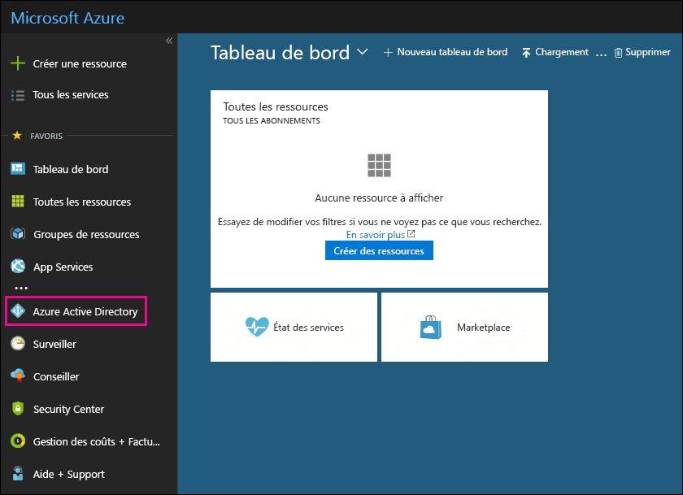

# Enregistrer votre abonnement gratuit Azure Active Directory dans Office 365

Si votre organisation a un abonnement payant à Office 365, Microsoft Dynamics CRM Online, Enterprise Mobility Suite ou d’autres services Microsoft, vous disposez d’un abonnement gratuit à Microsoft Azure Active Directory. Vous et les autres administrateurs pouvez utiliser Azure AD pour créer et gérer les comptes d’utilisateur et de groupe. Pour utiliser Azure AD, ouvrez le Portail Azure et connectez-vous à l’aide de votre compte Office 365.
  
## Avant de commencer

Ouvrez une session de navigation privée pour accéder au Portail Azure (voir l’étape 1 ci-dessous). Ainsi, les informations d’identification utilisées pour vous connecter ne sont pas transmises à Azure. Pour ouvrir une session de navigation InPrivate dans Internet Explorer ou une session de navigation privée dans Mozilla FireFox, appuyez sur CTRL+MAJ+P. Pour ouvrir une session de navigation privée dans Google Chrome (appelée mode navigation privée), appuyez sur CTRL+MAJ+N.
  
## Accès à Azure Active Directory

1. Accédez à [portal.azure.com](https://portal.azure.com) et connectez-vous avec votre compte professionnel ou étudiant Office 365. 
    
2. Dans le volet de navigation gauche du Portail Azure, cliquez sur **Azure Active Directory**.
    
    
  
    Le centre d’administration **Azure Active Directory** s’affiche. 
    
## Plus d’informations

- Vous pouvez également accéder au centre d'administration **Azure Active Directory** à partir du centre d'administration Microsoft 365. dans le volet de navigation de gauche du centre d'administration Microsoft 365, cliquez sur **centres** \> d'administration **Azure Active Directory**.
    
- Pour savoir comment gérer les utilisateurs et les groupes et exécuter d’autres tâches de gestion des répertoires, consultez l’article [Gérer votre répertoire Azure AD](https://docs.microsoft.com/azure/active-directory/active-directory-administer).
