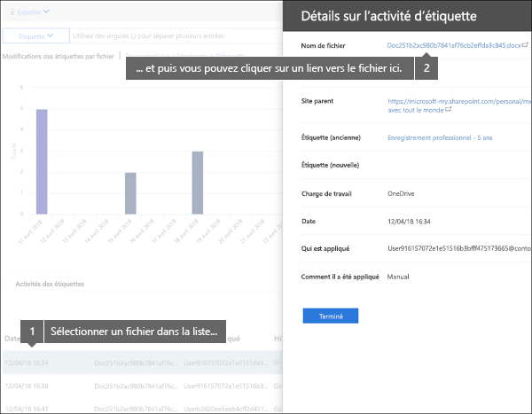
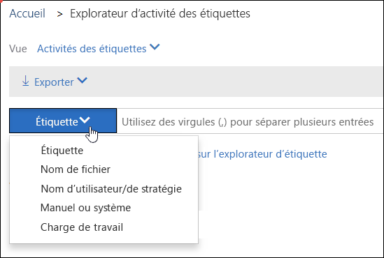

# Afficher l’activité des étiquettes pour les documentsView label activity for documents

Après avoir créé vos étiquettes, vérifiez qu’elles sont appliquées au contenu comme vous le souhaitez. Avec l’Explorateur d’activité des étiquettes dans le Centre de sécurité &amp; conformité Office 365, vous pouvez rapidement rechercher et afficher l’activité des étiquettes pour tout le contenu au sein de SharePoint et OneDrive Entreprise au cours des 30 derniers jours. Il s’agit des données en temps réel qui vous offrent une bonne visibilité de ce qui se passe dans votre client.After you create your labels, you'll want to verify that they're being applied to content as you intended. With the Label Activity Explorer in the Office 365 Security &amp; Compliance Center, you can quickly search and view label activity for all content across SharePoint and OneDrive for Business over the past 30 days. This is real-time data that gives you a clear view into what's happening in your tenant.
  
Par exemple, avec l’Explorateur d’activité des étiquettes, vous pouvez effectuer les actions suivantes :For example, with the Label Activity Explorer, you can:
  
- Afficher le nombre de fois où chaque étiquette a été appliquée chaque jour (jusqu’à 30 jours).View how many times each label was applied on each day (up to 30 days).
    
- Voir l’utilisateur qui a étiqueté un fichier spécifique et à quelle date, ainsi qu’un lien vers le site où se trouve ce fichier.See who labeled exactly which file on which date, along with a link to the site where that file resides.
    
- Afficher les fichiers dont les étiquettes ont été modifiées ou supprimées, les anciennes et nouvelles étiquettes, ainsi que la personne qui a effectué la modification.View which files had labels changed or removed, what the old and new labels are, and who made the change.
    
- Filtrer les données afin d’afficher toute l’activité liée à une étiquette, un fichier ou un utilisateur spécifique. Vous pouvez également filtrer l’activité liée aux étiquettes par emplacement (SharePoint ou OneDrive Entreprise) et voir si l’étiquette a été appliquée manuellement ou automatiquement.Filter the data to see all the label activity for a specific label, file, or user. You can also filter label activity by location (SharePoint or OneDrive for Business) and whether the label was applied manually or auto-applied.
    
- Consulter l’activité des étiquettes pour des dossiers ainsi que des documents individuels. Vous pourrez bientôt afficher le nombre de fichiers de ce dossier ayant été étiquetés suite à l’étiquetage du dossier en question.View label activity for folders as well as individual documents. Coming soon is the ability to show how many files inside that folder got labeled as a result of the folder getting labeled.
    
Vous trouverez l’Explorateur d’activité des étiquettes dans le Centre de sécurité &amp; conformité > **Gouvernance des données** > **Explorateur d’activité des étiquettes**.You can find the Label Activity Explorer in the Security  Compliance Center  Data governance  Label Activity Explorer.
  
Notez que l’Explorateur d’activité des étiquettes requiert un abonnement Office 365 Entreprise E5.Note that the Label Activity Explorer requires an Office 365 Enterprise E5 subscription.
  

  
## Afficher les activités des étiquettes pour les fichiers ou les dossiersView label activities for files or folders

En haut de l’Explorateur d’activité des étiquettes, vous pouvez choisir d’afficher les activités pour les fichiers ou les dossiers. Notez que l’activité des dossiers inclut uniquement le dossier lui-même, pas les fichiers contenus dans le dossier.At the top of the Label Activity Explorer, you can choose whether to view activities for files or folders. Note that folder activity includes only the folder itself, not the files inside the folder.
  
Vous voudrez peut-être consulter l’activité des étiquettes pour les dossiers, car si vous étiquetez un dossier, tous les fichiers contenus dans ce dossier sont également étiquetés (à l’exception des fichiers ayant été étiquetés spécifiquement). Par conséquent, l’étiquetage des dossiers risque d’affecter un certain nombre de fichiers. Pour obtenir plus d’informations, consultez la rubrique [Application d’une étiquette de rétention par défaut à tout le contenu d’une bibliothèque, d’un dossier ou d’un ensemble de documents SharePoint](labels.md#applying-a-default-retention-label-to-all-content-in-a-sharepoint-library-folder-or-document-set).You might want to see label activity for folders because if you label a folder, all files inside that folder also get that label (except for files that have had a label applied explicitly to them). Therefore, labeling folders might affect a significant number of files. For more information, see [Applying a default retention label to all content in a SharePoint library, folder, or document set](labels.md#applying-a-default-retention-label-to-all-content-in-a-sharepoint-library-folder-or-document-set).
  

  
### Activités des étiquettesLabel activities

 L’affichage **Activités des étiquettes** inclut toutes les actions relatives aux étiquettes : **ajout**, **suppression** ou **modification** d’une étiquette. Vous pouvez utiliser cet affichage pour obtenir une vue complète du nombre de fichiers auxquels une étiquette a été appliquée par jour.**Label activities** includes all label actions: **adding**, **removing**, or **changing** a label. You can use this view to get a comprehensive look at how many files each label's been applied to per day. 
  
### Modifications des étiquettesLabel changes

 L’affichage **Modifications des étiquettes** inclut les actions potentiellement risquées de **suppression** ou de **modification** d’une étiquette. Vous pouvez utiliser cet affichage pour consulter rapidement ces actions risquées et l’utilisateur qui les a effectuées. Dans la liste des activités située sous le graphique, vous pouvez sélectionner un fichier, puis cliquer sur un lien vers ce fichier dans le volet d’informations situé à droite.**Label changes** includes the potentially risky actions of **removing** or **changing** a label. You can use this view to quickly see such risky actions and the user who performed them. In the activity list below the chart, you can select a file, and then click a link to that file in the details pane on the right. 
  

  
## Filtre de l’activité des étiquettesFilter label activity

Vous pouvez rapidement filtrer les données pour afficher toutes les activités des étiquettes pour une étiquette, un fichier ou un utilisateur en particulier. Vous pouvez également filtrer l’activité des étiquettes par emplacement (SharePoint ou OneDrive Entreprise) et si l’étiquette a été appliquée manuellement ou automatiquement.You can quickly filter the data to see all the label activity for a specific label, file, or user. You can also filter label activity by location (SharePoint or OneDrive for Business) and whether the label was applied manually or auto-applied.
  

  

