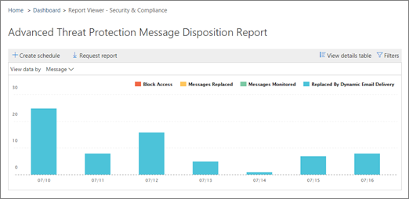

# Afficher les rapports de Protection de menace avancées d’Office 365

Si votre organisation a [Contre les menaces avancées Office 365](office-365-atp.md) (DAV) et que vous disposez des autorisations nécessaires, vous pouvez utiliser plusieurs rapports DAV dans la sécurité &amp; centre de conformité. (Accédez aux **rapports** \> **tableau de bord**.)
  

  
Rapports DAV incluent le [rapport d’état de protection de menace](view-reports-for-atp.md#advancedthreats), le [rapport de Types de fichiers DAV](view-reports-for-atp.md#atpfiletypes)et le [rapport de Disposition de Message DAV](view-reports-for-atp.md#atpmessagedisp). Cet article décrit les rapports DAV et inclut des liens vers [des rapports supplémentaires à afficher](view-reports-for-atp.md#addl).
  
## Rapport d’état Threat protection

Le rapport **d’état de protection de menace** est un affichage simple qui rassemble des informations concernant les e-mails malveillants et contenu malveillant détecté et bloqué par Exchange Online et de protection contre les menaces avancées. Le rapport fournit un nombre de messages unique contenant du code malveillant (fichiers ou URL) bloquées par le moteur anti-programme malveillant, [heures zéro automatique purge (ZAP)](zero-hour-auto-purge.md)et fonctionnalités protection contre les menaces avancées, telles que [Des liens fiables DAV](atp-safe-links.md), [DAV agrégé Pièces jointes sûres](atp-safe-attachments.md)et les [fonctionnalités anti-hameçonnage de DAV dans Office 365](atp-anti-phishing.md).
  
Pour afficher le rapport d’état Threat protection, de la sécurité &amp; centre de conformité, accédez aux **rapports** \> **tableau de bord** \> **état de protection de menace**.
  

  
Pour obtenir le statut détaillé d’un jour, pointez sur le graphique.
  

  
Par défaut, le rapport d’état Threat protection affiche les données pour les sept derniers jours. Toutefois, vous pouvez choisir les **filtres** et modifier la plage de dates pour afficher les données de 90 jours. 
  

  
Vous pouvez également utiliser le menu **Afficher les données** pour modifier les informations affichées dans le rapport. 
  

  
## Rapport sur les Types de fichier DAV

Le rapport de **Types de fichiers DAV** indique le type de fichiers détecté comme malveillants par les [Pièces jointes sûres DAV](atp-safe-attachments.md).
  
Pour afficher ce rapport, de la sécurité &amp; centre de conformité, accédez aux **rapports** \> **tableau de bord** \> **Types de fichiers DAV**.
  

  
Lorsque vous placez sur un jour donné, vous pouvez voir la répartition des types de fichiers malveillants qui ont été détectés par les [Pièces jointes sûres DAV](atp-safe-attachments.md) et [anti-spam &amp; protection anti-programme malveillant dans Office 365](anti-spam-and-anti-malware-protection.md).
  

  
## Rapport de Disposition de Message DAV

Le rapport de **Disposition de Message DAV** indique les actions qui ont été prises pour les messages électroniques qui ont été détectés comme ayant un contenu malveillant. 
  
Pour afficher ce rapport, de la sécurité &amp; centre de conformité, accédez aux **rapports** \> **tableau de bord** \> **Destruction du Message DAV**.
  

  
Lorsque vous placez sur une barre dans le graphique, vous pouvez voir les actions exécutées pour le courrier électronique détecté pour ce jour.
  

  
## Pour afficher des rapports supplémentaires

Outre les rapports DAV décrites dans cet article, les [rapports de sécurité de messagerie](view-email-security-reports.md) sont disponibles dans la sécurité &amp; centre de conformité. Rapports de sécurité de messagerie incluent un [rapport de destinataires et les principaux expéditeurs](view-email-security-reports.md#top-senders-and-recipients-report), un [rapport de messagerie de l’usurpation d’identité](view-email-security-reports.md#spoof-mail-report), un [rapport des détections de courrier indésirable](view-email-security-reports.md#spam-detections-report)et plus.
  
Et, si votre organisation dispose des [Informations sur les menaces Office 365](office-365-ti.md), vous pouvez également [Utilisez l’Explorateur de la sécurité &amp; centre de conformité](use-explorer-in-security-and-compliance.md).
  
## Les autorisations requises pour afficher ces rapports ?

Pour pouvoir afficher et utiliser les rapports de sécurité de messagerie décrites dans cet article, vous devez disposer d’un rôle approprié est affecté de la sécurité &amp; centre de conformité et dans le centre d’administration Exchange.
  
|**Groupe de rôles**|**Où affecté**|**En savoir plus**|
|:-----|:-----|:-----|
| Un des éléments suivants :     Gestion de l'organisation     Administrateur de sécurité     Lecteur de sécurité    |Sécurité &amp; centre de conformité    |[Autorisations de sécurité Office 365 &amp; centre de conformité](permissions-in-the-security-and-compliance-center.md)   |
| Un des éléments suivants :     Gestion de l'organisation     Gestion de l'organisation en affichage seul     Rôle Destinataires en affichage uniquement     Gestion de la conformité    |Centre d’administration Exchange    |[Autorisations des fonctionnalités dans Exchange Online](https://technet.microsoft.com/library/jj200673%28v=exchg.150%29.aspx)   |
   
## Que se passe-t-il si les rapports ne sont pas affichant les données ?

Si vous ne voyez pas les données dans vos rapports, vérifiez que vos stratégies sont correctement configurés. Votre organisation doit avoir des [stratégies DAV fiables liens](set-up-atp-safe-links-policies.md) et [pièces jointes sûres DAV stratégies](set-up-atp-safe-attachments-policies.md) définies dans l’ordre de protection DAV pour mettre en place. Consultez également la [protection contre le courrier indésirable et anti-programme malveillant dans Office 365](anti-spam-and-anti-malware-protection.md).
  
## Voir aussi

[Rapports et vues d’ensemble de sécurité Office 365 &amp; centre de conformité](reports-and-insights-in-security-and-compliance.md)
  
[Créer une planification pour un état de la sécurité &amp; centre de conformité](create-a-schedule-for-a-report.md)
  
[Configurer et télécharger un rapport personnalisé dans la sécurité &amp; centre de conformité](set-up-and-download-a-custom-report.md)
  

