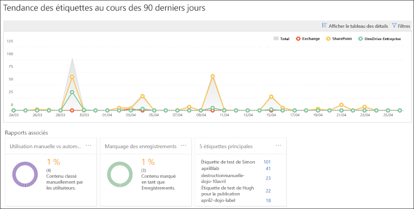
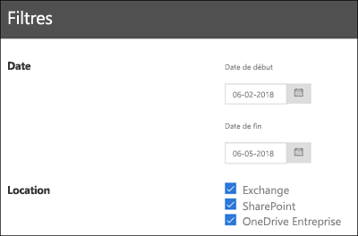

# Affichage des rapports de gouvernance des donnéesView the data governance reports

Après avoir créé vos étiquettes, vous pouvez vérifier si elles sont appliquées au contenu comme vous le souhaitiez. Dans les rapports de gouvernance des données du Centre de sécurité &amp; conformité Office 365, vous pouvez consulter rapidement les informations suivantes :After you create your labels, you'll want to verify that they're being applied to content as you intended. With the data governance reports in the Office 365 Security &amp; Compliance Center, you can quickly view:
  
- **5 premières étiquettes** Ce rapport indique les 5 premières étiquettes qui ont été appliquées au contenu. Cliquez sur ce rapport pour afficher la liste de toutes les étiquettes récemment appliquées au contenu. Vous pouvez connaître leur valeur, leur emplacement, la façon dont elles ont été appliquées, leurs actions de rétention, si ce sont des enregistrements et leur mode de destruction.**Top 5 labels** This report shows the count of the top 5 labels that have been applied to content. Click this report to view a list of all labels that have been recently applied to content. You can see each label's count, location, how it was applied, its retention actions, whether it's a record, and its disposition type. 
    
- **Application manuelle et automatique** Ce rapport indique la valeur de tout le contenu étiqueté manuellement ou automatiquement et le pourcentage de contenu étiqueté manuellement et automatiquement.**Manual vs Auto apply** This report shows the count of all content that's been labeled manually or automatically, and the percentage of content that's been labeled manually vs automatically. 
    
- **Étiquetage des enregistrements** Ce rapport indique la valeur de tout le contenu marqué comme un enregistrement ou non, et le pourcentage de contenu marqué comme un enregistrement ou non.**Records tagging** This report shows the count of all content that's been tagged as a record or non-record, and the percentage of content that's been tagged as a record vs. non-record. 
    
- **Tendance des étiquettes au cours des 90 derniers jours** Ce rapport indique la valeur et l’emplacement de toutes les étiquettes qui ont été appliquées au cours des 90 derniers jours.**Labels trend over the past 90 days** This report shows the count and location of all labels that have been applied in the last 90 days. 
    
Tous ces rapports affichent le contenu étiqueté dans Exchange, SharePoint et OneDrive Entreprise.All these reports show labeled content from Exchange, SharePoint, and OneDrive for Business.
  
Vous trouverez ces rapports dans le Centre de sécurité &amp; conformité \> **Gouvernance des données** \> **Tableau de bord**.You can find these reports in the Security &amp; Compliance Center \> **Data Governance** \> **Dashboard**.
  

  
Vous pouvez filtrer les rapports de gouvernance des données par date (90 jours maximum) et par emplacement (Exchange, SharePoint et OneDrive Entreprise). Les données les plus récentes sont affichées dans les rapports dans un délai de 24 heures.You can filter the data governance reports by date (up to 90 days) and location (Exchange, SharePoint, and OneDrive for Business). The most recent data can take up to 24 hours to appear in the reports.
  

  

