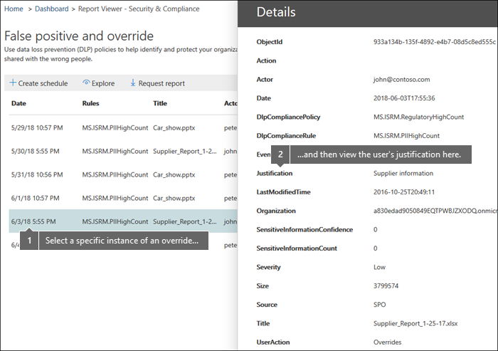

# Affichage des rapports de protection contre la perte de données

Après avoir créé vos stratégies de protection contre la perte de données (DLP), vous souhaiterez vérifier qu’elles fonctionnent comme vous le souhaitez et vous aider à rester conformes. Les rapports DLP du centre de sécurité &amp; conformité Office 365 vous permettent d’afficher rapidement les éléments suivants:
  
- **Correspondances de stratégie DLP** Ce rapport indique le nombre de correspondances de stratégie DLP dans le temps. Vous pouvez filtrer le rapport par date, emplacement, stratégie ou action. Vous pouvez utiliser ce rapport pour: 
    
  - Réglez ou Affinez vos stratégies DLP lorsque vous les exécutez en mode test. Vous pouvez afficher la règle spécifique qui correspond au contenu.
    
  - Vous concentrer sur des périodes de temps spécifiques et comprendre les raisons des pics et des tendances.
    
  - Découvrez les processus d’entreprise qui enfreignent les stratégies DLP de votre organisation.
    
  - Comprendre l’impact des stratégies DLP sur l’entreprise en examinant les actions appliquées au contenu.
    
  - Vérifier la conformité avec une stratégie DLP spécifique en affichant les correspondances pour cette stratégie.
    
  - Affichez la liste des utilisateurs les plus fréquents et répétez les utilisateurs qui contribuent aux incidents de votre organisation.
    
  - Affichez la liste des principaux types d’informations sensibles dans votre organisation.
    
- **Incidents DLP** Ce rapport affiche également les correspondances de stratégie dans le temps, comme la stratégie établit le rapport. Toutefois, le rapport sur les correspondances de stratégie indique les correspondances au niveau de la règle; par exemple, si un message électronique correspond à trois règles différentes, la stratégie correspond à un rapport affiche trois éléments de ligne différents. En revanche, le rapport incidents affiche les correspondances au niveau de l’élément; par exemple, si un message électronique correspond à trois règles différentes, le rapport incidents affiche un seul élément de ligne pour cette partie de contenu. 
    
  Étant donné que le nombre de rapports est agrégé différemment, la stratégie établit une correspondance avec le rapport pour identifier les correspondances avec des règles spécifiques et ajuster les stratégies DLP. Le rapport incidents est plus approprié pour identifier des parties de contenu spécifiques qui sont problématiques pour vos stratégies DLP.
    
- **Les faux positifs et les remplacements DLP** Si votre stratégie DLP permet aux utilisateurs de la remplacer ou de signaler un faux positif, ce rapport affiche un décompte de ces instances dans le temps. Vous pouvez filtrer le rapport par date, par emplacement ou par stratégie. Vous pouvez utiliser ce rapport pour: 
    
  - Ajuster ou affiner vos stratégies DLP en examinant les stratégies qui impliquent un nombre élevé de faux positifs.
    
  - Affichez les justifications soumises par les utilisateurs lorsqu’ils résolvent un Conseil de stratégie en substituant la stratégie.
    
  - Découvrez comment les stratégies DLP entrent en conflit avec les processus d’entreprise valides en raison d’un nombre élevé de remplacements utilisateur.
    
Tous les rapports DLP peuvent afficher les données de la période de quatre mois la plus récente. Les données les plus récentes peuvent prendre jusqu’à 24 heures pour apparaître dans les rapports.
  
Ces rapports sont disponibles dans le tableau de &amp; **bord**rapports \> **** \> du centre de sécurité et de conformité.
  

  
## Afficher la justification envoyée par un utilisateur pour une substitution

Si votre stratégie DLP permet aux utilisateurs de la remplacer, vous pouvez utiliser le rapport de faux positif et de remplacement pour afficher le texte soumis par les utilisateurs dans le Conseil de stratégie.
  

  
## Prendre des mesures sur les informations et les recommandations

Les rapports peuvent indiquer des informations et des recommandations où vous pouvez cliquer sur l’icône d’avertissement rouge pour afficher des détails sur les problèmes potentiels et prendre des mesures correctives possibles.
  

  
## Autorisations pour les rapports DLP

Pour afficher les rapports DLP dans le centre de sécurité & conformité, vous devez disposer des éléments suivants:

- Rôle **lecteur de sécurité** dans le centre d’administration Exchange. Par défaut, ce rôle est affecté aux groupes de rôles gestion de l’organisation et lecteur de sécurité dans le centre d’administration Exchange.

- Rôle de **gestion de conformité DLP en lecture seule** dans le centre de sécurité & conformité. Par défaut, ce rôle est affecté aux groupes de rôles Administrateur de conformité, gestion de l’organisation, administrateur de sécurité et lecteur de sécurité dans le centre de sécurité & conformité.

- Rôle destinataires en **Affichage seul** dans le centre d’administration Exchange. Par défaut, ce rôle est affecté aux groupes de rôles gestion de la conformité, gestion de l’organisation et gestion de l’organisation en affichage seul dans le centre d’administration Exchange.

## Rechercher les applets de commande pour les rapports DLP

Pour utiliser la plupart des applets de commande pour &amp; le centre de sécurité conformité, vous devez:
  
1. [Se connecter au Centre de sécurité &amp; conformité Office 365 à l’aide de PowerShell à distance](http://go.microsoft.com/fwlink/?LinkID=799771&amp;clcid=0x409)
    
2. Utiliser l’une des applets de commande du [Centre de sécurité &amp; conformité Office 365](http://go.microsoft.com/fwlink/?LinkID=799772&amp;clcid=0x409)
    
Toutefois, les rapports DLP doivent extraire des données d’Office 365, y compris Exchange Online. Pour cette raison, les applets de commande pour les rapports DLP sont disponibles dans Exchange Online PowerShell, et &amp; non dans le centre de sécurité conformité PowerShell. Par conséquent, pour utiliser les applets de commande pour les rapports DLP, vous devez:
  
1. [Connect to Exchange Online using remote PowerShell](http://go.microsoft.com/fwlink/?LinkID=799773&amp;clcid=0x409)
    
2. Utilisez l’une de ces applets de commande pour les rapports DLP:
    
      - [Get-DlpDetectionsReport](http://go.microsoft.com/fwlink/?LinkID=799774&amp;clcid=0x409)
    
      - [Get-DlpDetailReport](http://go.microsoft.com/fwlink/?LinkID=799775&amp;clcid=0x409)
    

