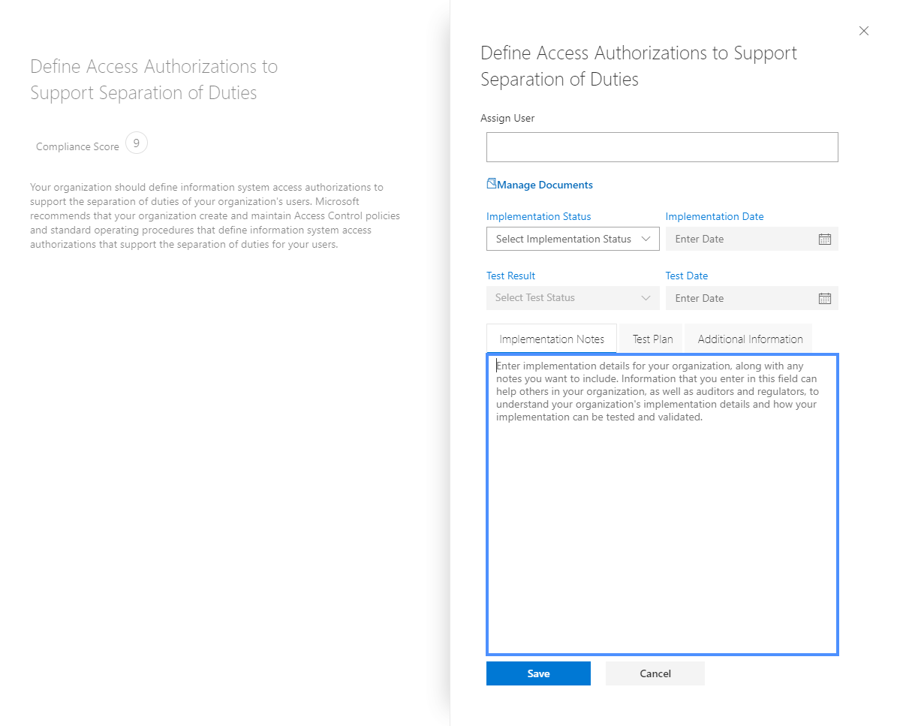

# <a name="work-with-microsoft-compliance-manager-preview"></a>Utiliser le gestionnaire de conformité Microsoft (aperçu)

> [!IMPORTANT]
> Le gestionnaire de conformité Microsoft est un tableau de bord et un outil de gestion qui fournit un résumé de votre stature de protection et de conformité des données afin d’améliorer la protection et la conformité des données. Les actions client fournies dans le gestionnaire de conformité sont des recommandations; Il revient à votre organisation d’évaluer l’efficacité de ces recommandations dans son environnement réglementaire respectif avant la mise en œuvre. Les recommandations figurant dans le gestionnaire de conformité ne doivent pas être interprétées comme garantie de conformité.

## <a name="access-compliance-manager"></a>Gestionnaire de conformité des accès

Le Gestionnaire de conformité est accessible depuis le Portail d’approbation de services. Toute personne ayant un compte Microsoft ou un compte professionnel Azure Active Directory peut accéder au Gestionnaire de conformité.
  
1. Accédez à [https://servicetrust.microsoft.com](https://servicetrust.microsoft.com/).

2. Connectez-vous à l’aide de votre compte de service Microsoft. Il s’agit de votre compte d’utilisateur Office 365, Microsoft 365 ou Azure Active Directory (Azure AD).

3. Dans le portail d’approbation de service, sélectionnez **Gestionnaire de conformité**. Il s’agit de la version préliminaire du gestionnaire de conformité. Le **Gestionnaire de conformité (classique)** est le lien vers la version précédente du gestionnaire de conformité.

4. Lorsque le contrat de non-divulgation est affiché, lisez-le, puis sélectionnez **accepter** pour continuer. Vous devez accepter une fois, puis le tableau de bord du gestionnaire de conformité s’affiche.

Pour vous aider à démarrer, une évaluation ISO/IEC 27001:2103 pour Office 365 s’affiche par défaut pour votre organisation.

## <a name="administration"></a>Administration

Il existe des fonctions d’administration spécifiques uniquement disponibles pour l’administrateur client et visibles uniquement lorsque vous êtes connecté avec un compte d’administrateur général. Toutefois, tant que l’administrateur n’a pas affecté les rôles du gestionnaire de conformité aux utilisateurs, les données du gestionnaire de conformité sont visibles pour tous les utilisateurs de votre organisation. Nous vous recommandons d’implémenter le contrôle d’accès basé sur un rôle pour déterminer qui peut accéder à et effectuer des actions dans le gestionnaire de conformité.
  
### <a name="assigning-compliance-manager-roles-to-users"></a>Affectation des rôles du Gestionnaire de conformité aux utilisateurs

Chaque rôle de gestionnaire de conformité a des autorisations légèrement différentes. Vous pouvez afficher les autorisations affectées à chaque rôle, voir les utilisateurs qui se trouvent dans quels rôles et ajouter ou supprimer des utilisateurs de ce rôle via le portail d’approbation de services. Sélectionnez l’option de menu **admin** , puis choisissez les **paramètres** à afficher.
  

  
Pour ajouter ou supprimer des utilisateurs des rôles du Gestionnaire de conformité.
  
1. Accédez à [https://servicetrust.microsoft.com](https://servicetrust.microsoft.com).

2. Connectez-vous avec votre compte Administrateur général Azure Active Directory.

3. Dans la barre de menus supérieure du portail d’approbation de service, sélectionnez **administrateur** , puis **paramètres**.

4. Dans la liste déroulante **Sélectionner un rôle** , sélectionnez le rôle que vous souhaitez gérer.

5. Les utilisateurs ajoutés à chaque rôle sont répertoriés sur la page **Sélectionner un rôle** .

6. Pour ajouter des utilisateurs à ce rôle, sélectionnez **Ajouter**. Dans la boîte de dialogue **Ajouter des utilisateurs** , sélectionnez le champ utilisateur. Vous pouvez faire défiler la liste des utilisateurs disponibles ou commencer à taper le nom d’utilisateur pour filtrer la liste en fonction de votre terme de recherche. Sélectionnez l’utilisateur qui doit ajouter ce compte à la liste **Ajouter des utilisateurs** mise en service avec ce rôle. Si vous souhaitez ajouter plusieurs utilisateurs simultanément, commencez à taper un nom d’utilisateur pour filtrer la liste, puis sélectionnez l’utilisateur à ajouter à la liste. Sélectionnez **Enregistrer** pour mettre en service le rôle sélectionné pour ces utilisateurs. 

    
  
7. Pour supprimer des utilisateurs de ce rôle, sélectionnez les utilisateurs et sélectionnez **supprimer**.

    

## <a name="groups"></a>Groupes

Les groupes vous permettent d’organiser les évaluations de manière logique et de partager des informations et des tâches de flux de travail communes entre les évaluations qui ont le même contrôle ou les mêmes contrôles gérés par le client. Vous pouvez regrouper les évaluations par année, standard, service, équipe, division ou organisme au sein de votre organisation pour limiter les actions gérées par les clients:
  
- **FFIEC est une évaluation 2019**
  - Office 365 + FFIEC est
  - Intune + FFIEC est
- **Évaluations de confidentialité et de sécurité des données**
  - Office 365 + ISO 27001:2013
  - Office 365 + ISO 27018:2014

Lorsque vous créez une nouvelle évaluation, vous devez créer un groupe pour l’évaluation ou attribuer l’évaluation à un groupe existant. Il n’est pas possible de créer des groupes en tant qu’entités autonomes. Il est recommandé de déterminer une stratégie de regroupement pour votre organisation *avant* d’ajouter de nouvelles évaluations. Par défaut, un groupe nommé «groupe par défaut» est disponible pour vos évaluations initiales. Les groupes n’ont pas de propriétés de sécurité. Toutes les autorisations sont associées à des évaluations.

Lorsque vous utilisez des groupes, rappelez-vous des éléments suivants:
  
- Les contrôles d’évaluation associés dans différentes évaluations au sein du même groupe sont automatiquement mis à jour lorsque vous avez terminé.
- Les nouveaux groupes peuvent copier des informations à partir d’un groupe existant lorsque vous créez une nouvelle évaluation. Toutes les informations ajoutées aux champs détails de l’implémentation et plan de test et réponse de gestion des contrôles gérés par le client à partir des évaluations dans le groupe à partir duquel vous effectuez la copie sont copiées dans les mêmes contrôles gérés par le client (ou associés) dans le nouveau Évaluation. Si vous ajoutez une nouvelle évaluation à un groupe existant, les informations courantes des évaluations dans ce groupe sont copiées dans la nouvelle évaluation.
- Les noms de groupe (également appelés *ID de groupe*) doivent être uniques au sein de votre organisation.
- Les groupes peuvent contenir des évaluations pour la même certification/réglementation, mais chaque groupe ne peut contenir qu’une seule évaluation pour une paire service Cloud/certification de Cloud spécifique. Par exemple, un groupe ne peut pas contenir deux évaluations pour Office 365 et l’infrastructure NIST. Un groupe peut contenir plusieurs évaluations pour le même service Cloud uniquement si la certification/réglementation correspondante est différente.
- Une fois qu’une évaluation a été ajoutée à un groupe d’évaluation, le regroupement ne peut pas être modifié. Vous pouvez renommer le groupe d’évaluation, ce qui modifie le nom du regroupement d’évaluation pour toutes les évaluations associées à ce groupe. Vous pouvez créer une évaluation et un nouveau groupe d’évaluation et copier des informations à partir d’une évaluation existante, ce qui crée effectivement un doublon de cette évaluation dans un groupe d’évaluation différent.
- L’archivage d’une évaluation rompt la relation entre cette évaluation et le groupe. Les autres mises à jour apportées à d’autres évaluations associées ne sont plus reflétées dans l’évaluation archivée.

## <a name="tenant-management"></a>Gestion des clients

Le gestionnaire de conformité (Preview) inclut une nouvelle interface de gestion des nouveaux éléments de données appelée **gestion des clients**. Cette interface vous permet de gérer les paramètres à l’échelle du client:

- **Dimensions:** Afficher, ajouter et personnaliser des métadonnées pour des modèles, des évaluations et des éléments d’action qui vous permettent de créer des tableaux croisés dynamiques personnalisés pour les filtres.
- **Propriétaires:** Spécifiez un propriétaire pour chaque élément d’action.
- **Actions des clients:** Gérez la liste complète des éléments actions inclus dans le gestionnaire de conformité (aperçu) et activez/désactivez la surveillance du score sécurisé pour les actions intégrées à un score sécurisé.

Sélectionnez **gestion des clients** pour ouvrir l’interface de gestion et suivez les étapes ci-dessous pour gérer les **dimensions**, les **propriétaires**et les **actions des clients**.

### <a name="dimensions"></a>Dimensions

Les dimensions sont des ensembles de métadonnées qui fournissent des informations sur un modèle, une évaluation ou un élément d’action. Les dimensions utilisent le concept de clés et de valeurs, où la clé de dimension représente une propriété et la valeur de dimension représente des valeurs valides pour la propriété. Par exemple, dans le gestionnaire de conformité, il existe trois types d’actions. Elles sont définies par une clé de dimension de **type action** et des valeurs de dimension de **documentation**, d' **exploitation**et **technique**. Vous pouvez modifier des dimensions existantes ou ajouter les vôtres. Il est souvent nécessaire d’ajouter des dimensions lors de l’importation de modèles personnalisés.

#### <a name="add-a-dimension"></a>Ajouter une dimension

1. Ouvrez la **gestion des clients** et sélectionnez des **dimensions**.
2. Sélectionnez **+ Ajouter une dimension**.
3. Entrez un nom unique dans le champ **clé** .
4. Si vous le souhaitez, vous pouvez activer l’utilisation simultanée de plusieurs valeurs pour la même clé, puis faites glisser le bouton bascule pour **autoriser la sélection multiple des dimensions** à activé.
5. Sélectionnez **+ Ajouter** pour ajouter une valeur en fournissant un nom unique et en cliquant sur l’icône Enregistrer.
6. Répétez l’étape 5 pour chaque valeur que vous souhaitez ajouter.
7. Sélectionnez **Enregistrer** pour enregistrer la nouvelle dimension.

#### <a name="edit-a-dimension"></a>Modifier une dimension

Vous pouvez renommer une clé de dimension, mais vous pouvez modifier les valeurs des dimensions personnalisées.

1. Ouvrez la **gestion des clients** et sélectionnez des **dimensions**.
2. Recherchez la dimension que vous souhaitez modifier, sélectionnez les points de suspension (...) en regard de celle-ci, puis sélectionnez **modifier**.
3. Sélectionnez **+ Ajouter** pour ajouter une valeur en fournissant un nom unique et en cliquant sur l’icône Enregistrer, ou sélectionnez la valeur à modifier ou supprimer, puis sélectionnez **supprimer** ou **modifier**.
4. Sélectionnez **Enregistrer** lorsque vous avez terminé d’apporter des modifications.

#### <a name="delete-a-dimension"></a>Supprimer une dimension

Vous pouvez supprimer des dimensions personnalisées si nécessaire.

1. Ouvrez la **gestion des clients** et sélectionnez des **dimensions**.
2. Recherchez la dimension que vous souhaitez supprimer, sélectionnez les points de suspension (...) en regard de celle-ci, puis sélectionnez **supprimer**.
3. Lorsque le message de confirmation s’affiche, sélectionnez **supprimer**.

### <a name="owners"></a>Propriétaires

Les propriétaires sont utilisés pour identifier la partie responsable de chaque contrôle. Tous les contrôles intégrés appartiennent à Microsoft, aux clients ou aux deux. Vous pouvez créer des valeurs personnalisées pour les propriétaires qui peuvent être utilisées pour spécifier des responsabilités plus granulaires au sein de votre organisation. Par exemple, vous pouvez créer des propriétaires qui représentent des groupes, des équipes ou des divisions spécifiques au sein de votre organisation.

#### <a name="add-an-owner"></a>Ajouter un propriétaire

1. Ouvrez **gestion des clients** et sélectionnez **propriétaires**.
2. Sélectionnez **+ Ajouter un propriétaire**.
3. Indiquez un nom et une description pour le propriétaire, puis sélectionnez **Enregistrer**. La description est affichée dans la colonne propriétaire.

#### <a name="edit-an-owner"></a>Modifier un propriétaire

Vous ne pouvez pas modifier un nom de propriétaire, mais vous pouvez modifier la description qui est affichée dans la colonne propriétaire.

1. Ouvrez **gestion des clients** et sélectionnez **propriétaires**.
2. Recherchez le propriétaire que vous souhaitez modifier, sélectionnez les points de suspension (...) en regard de celui-ci, puis sélectionnez **modifier**.
3. Modifiez la description si nécessaire, puis sélectionnez **Enregistrer**.

#### <a name="delete-an-owner"></a>Supprimer un propriétaire

1. Ouvrez **gestion des clients** et sélectionnez **propriétaires**.
2. Recherchez le propriétaire que vous souhaitez supprimer, sélectionnez les points de suspension (...) en regard de celui-ci, puis sélectionnez **supprimer**.
3. Lorsque le message de confirmation s’affiche, sélectionnez **supprimer**.

### <a name="customer-actions"></a>Actions client

La zone actions client affiche toutes les actions des clients pour tous les modèles et évaluations dans le gestionnaire de conformité (aperçu).


En un clin d’œil, vous pouvez voir le titre, le propriétaire, la catégorie, l’application et le score d’une action, et déterminer si elle est intégrée avec le score de sécurité. Vous pouvez développer une action et sélectionner **More** pour lire la description de l’action et accéder à tous les liens dans la description. Vous pouvez également utiliser cette interface pour activer et désactiver l’intégration de la note sécurisée en fonction de l’action et pour ajouter des actions personnalisées. Les actions qui ont des fonctions d’intégration de score sécurisé comportent des points de suspension (...) en regard de celles-ci (Notez que les actions personnalisées comportent également des points de suspension).

#### <a name="enable-or-disable-secure-score-integration"></a>Activer ou désactiver l’intégration de la note sécurisée

1. Sélectionnez les points de suspension (...) de l’action que vous souhaitez modifier, puis sélectionnez **modifier**.
2. Basculez le commutateur de la mise à jour continue du score de sécurité sur activé ou désactivé pour activer ou désactiver la surveillance continue via le score de sécurité.
3. Cliquez sur **Enregistrer**.

#### <a name="add-a-customer-action"></a>Ajouter une action client

1. Sélectionnez **+ Ajouter une action client**.
2. Fournissez un titre unique pour l’action dans le champ **titre** .
3. Fournissez un score de conformité pour l’action dans le champ **score de conformité maximal** (il peut s’agir d’un nombre quelconque compris entre 1-99).
4. Utilisez la liste déroulante **type d’action** pour spécifier le type d’action que vous ajoutez. Si le type d’action n’existe pas, vous pouvez l’ajouter en ajoutant la valeur à la clé de dimension type d’action.
5. Utilisez la liste déroulante **dimensions** pour spécifier ou ajouter des clés et des valeurs de dimension pour l’action.
6. Utilisez la liste déroulante **propriétaire** pour spécifier le propriétaire de l’action.
7. Sélectionnez **+** cette option pour ajouter une description et un titre de description pour l’action.
8. Sélectionnez le **X** pour fermer le panneau de description.
9. Sélectionnez **Enregistrer** pour enregistrer l’action du client.

#### <a name="edit-a-customer-action"></a>Modifier une action client

1. Sélectionnez les points de suspension (...) de l’action que vous souhaitez modifier, puis sélectionnez **modifier**.
2. Modifiez l’action comme vous le souhaitez, puis sélectionnez **Enregistrer**.

#### <a name="delete-a-customer-action"></a>Supprimer une action client

1. Sélectionnez les points de suspension (...) correspondant à l’action que vous souhaitez modifier, puis sélectionnez **supprimer**.
2. Lorsque le message de confirmation s’affiche, sélectionnez **supprimer**.

## <a name="assessments"></a>Évaluations

### <a name="add-an-assessment"></a>Ajouter une évaluation
  
1. Dans le tableau de bord évaluations, sélectionnez **+ Ajouter une évaluation**.

2. À l’ouverture de la lame, entrez les informations suivantes:

    - **Titre (obligatoire):** Entrer un titre pour votre évaluation
    - **Sélectionnez un modèle (obligatoire):** Sélectionner un modèle standard ou personnalisé
    - **Sélectionnez un groupe ou ajoutez un nouveau groupe (obligatoire):** Sélectionnez un groupe existant ou choisissez d’ajouter un nouveau groupe, et fournissez un nom de groupe unique.
    - Voulez- **vous copier les données à partir d’un groupe existant? (facultatif):** fait basculer le contrôle pour activer la copie de groupe, puis:
        - **Sélectionnez un groupe (facultatif):** Si la copie de groupe est activée, sélectionnez le groupe à partir duquel effectuer la copie.
            - **Détails de l’implémentation (facultatif):** Sélectionnez cette option pour copier les détails de l’implémentation dans le nouveau groupe.
            - **Plan de test & informations supplémentaires (facultatif):** Sélectionnez cette option pour copier le plan de test et les détails des informations supplémentaires dans le nouveau groupe.
            - **Documents (facultatif):** Sélectionnez cette option pour copier les documents vers le nouveau groupe

3. Sélectionnez **Enregistrer** pour créer l’évaluation.

 La nouvelle évaluation apparaît sur le tableau de bord d’évaluation et affiche les informations suivantes:

- Titre de l’évaluation.
- Les dimensions de l’évaluation, y compris la certification, l’environnement et le produit, appliquées à l’évaluation.
- Date de création et date de la dernière modification.
- Score d’évaluation affiché sous la forme d’un pourcentage.
- Indicateurs de progression indiquant le nombre de contrôles évalués gérés par Microsoft et gérés par le client.

### <a name="copying-information-from-existing-assessments"></a>Copie des informations des évaluations existantes

Lorsque vous créez une évaluation, vous avez la possibilité de copier des informations à partir d’un groupe existant. Cela vous permet d’appliquer les informations entrées dans l’évaluation copiée aux mêmes contrôles dans la nouvelle évaluation. Par exemple, si vous avez un groupe pour toutes les évaluations liées à FFIEC dans votre organisation, vous pouvez copier les informations suivantes à partir d’évaluations existantes:

- Détails de l’implémentation
- Informations supplémentaires sur le plan de test &
- Documents

#### <a name="copy-information-from-an-existing-assessment-to-a-new-assessment"></a>Copier des informations d’une évaluation existante vers une nouvelle évaluation
  
1. Dans le tableau de bord d’évaluation, sélectionnez **+ Ajouter une évaluation**.
    
2. Dans la fenêtre **Ajouter une évaluation** , fournissez les informations suivantes

    - **Titre (obligatoire):** Entrez un titre pour votre évaluation.
    - **Sélectionnez un modèle (obligatoire):** Sélectionnez un modèle standard ou personnalisé.
    - **Sélectionnez un groupe ou ajoutez un nouveau groupe (obligatoire):** Sélectionnez **Ajouter un nouveau groupe** et indiquez un nom de groupe unique.
    - Voulez- **vous copier les données à partir d’un groupe existant? (facultatif):** fait basculer le contrôle sur activé pour activer la copie de groupe, puis:- **Sélectionner un groupe (facultatif):** si la copie de groupe est activée, sélectionnez le groupe à partir duquel copier.
            - **Détails de l’implémentation (facultatif):** Sélectionnez cette option pour copier les détails de l’implémentation dans le nouveau groupe.
            - **Plan de test & informations supplémentaires (facultatif):** Sélectionnez cette option pour copier le plan de test et les détails des informations supplémentaires dans le nouveau groupe.
            - **Documents (facultatif):** Sélectionnez cette option pour copier les documents vers le nouveau groupe.

3. Sélectionnez **Enregistrer** pour créer l’évaluation.

### <a name="viewing-assessments"></a>Affichage des évaluations

#### <a name="view-an-assessment"></a>Afficher une évaluation
  
1. Dans le tableau de bord évaluations, sélectionnez le nom de l’évaluation pour l’ouvrir et afficher les éléments d’action et les informations de contrôle.

Voici un exemple de l’évaluation pour Office 365 et ISO 27001. La première vue illustre la nouvelle vue actions dans le gestionnaire de conformité (aperçu).


Les actions sont répertoriées par ordre alphabétique et un score et un propriétaire sont attribués à chaque action. Sélectionnez le lien **en savoir plus** pour lire les détails de chaque action. 


Sélectionnez le lien **examiner** pour gérer, affecter, mettre en œuvre et tester l’action. Vous trouverez ci-dessous un exemple d’action.



Dans les versions précédentes du gestionnaire de conformité, le flux de travail pour l’implémentation des exigences a été effectué au niveau du contrôle. Un officier de conformité affecte un contrôle à une personne afin d’implémenter le contrôle. Il y avait deux inconvénients à cela:

- Les contrôles ont souvent été associés à plusieurs actions, et l’utilisateur auquel un contrôle a été affecté n’est peut-être pas la personne appropriée pour effectuer toutes les actions requises pour implémenter le contrôle
- La combinaison de tâches distinctes en une seule action a empêché la collecte des signaux et de la télémétrie qui est utilisée pour enregistrer automatiquement les modifications de configuration du client dans le gestionnaire de conformité (aperçu).

Dans le gestionnaire de conformité (aperçu), le processus de flux de travail est passé du niveau de contrôle au niveau d’action. Lors de l’examen d’une action, les champs suivants peuvent être utilisés pour gérer le flux de travail d’action:

- **Attribuer un utilisateur:** Sélectionnez ce champ pour choisir ou entrer l’utilisateur auquel cette action doit être affectée. Vous pouvez faire défiler la liste ou taper un nom pour le trouver, puis le sélectionner.
- **Gérer les documents:** Vous pouvez charger des preuves de l’implémentation sous la forme de documents Office, de fichiers image et de captures d’écran, de sorties PowerShell au format CSV ou TXT, et de fichiers PDF.
- **État de l’implémentation:** Permet d’indiquer l’état actuel de l’implémentation. Les valeurs possibles ne sont pas implémentées, implémentées, une implémentation alternative, planifiée et non dans l’étendue.
- **Date d’implémentation:** Date à laquelle l’action a été effectuée.
- **Résultat du test:** Permet d’indiquer les résultats de la validation de l’implémentation. Les valeurs possibles ne sont pas calculées, transmises, échec-faible risque, échec moyen-risque, échec à haut risque et non dans l’étendue.
- **Date du test:** Date à laquelle la validation s’est produite.
- **Remarques sur l’implémentation:** Entrez les détails d’implémentation de votre organisation, ainsi que les notes que vous souhaitez inclure.
- **Plan de test:** Entrez les détails du plan de test pour cette action, ainsi que les notes que vous souhaitez inclure.
- **Informations supplémentaires:** Entrez des informations supplémentaires sur cette action ou la manière dont elle a été implémentée dans votre organisation, ainsi que les notes que vous souhaitez inclure.

Le gestionnaire de conformité (aperçu) inclut également le tableau croisé dynamique basé sur le contrôle dans les versions précédentes. Sélectionnez le tableau de bord informations sur les **contrôles** pour l’afficher. Vous pouvez afficher des informations sur les contrôles au niveau de l’évaluation et du modèle. Vous trouverez ci-dessous un exemple de tableau de bord d’informations des contrôles pour les évaluations.


Pour les évaluations, le tableau de bord informations sur les contrôles affiche les éléments suivants:

- Une liste déroulante de **groupe** pour sélectionner le groupe à afficher (en cas d’utilisation de plusieurs groupes).
- Liste déroulante d' **évaluation** permettant de sélectionner l’évaluation à afficher.
- Métadonnées relatives à l’évaluation sélectionnée, notamment:
    - Indicateur de progression pour les **contrôles évalués** illustrant le nombre de contrôles évalués sur le nombre total de contrôles.
    - Score de **conformité** actuel pour l’évaluation, affiché sous la forme d’un pourcentage.
    - Détails sur la **certification** et le **produit** utilisés dans l’évaluation.
    - **État** actuel et date de dernière **modification** de l’évaluation.
- Une liste des **services dans l’étendue** pour l’évaluation.
- Détails des contrôles, regroupés par famille de contrôle, avec des liens vers les actions client et les détails de la mise en œuvre de Microsoft:
    - **Vos actions** affichent les actions du client que vous pouvez effectuer pour satisfaire une partie ou la totalité des exigences du contrôle. De nombreux contrôles ont plusieurs actions associées et toutes les actions associées à un contrôle sont affichées ici. Les actions indiquées ici ont la même interface utilisateur que celles répertoriées dans le tableau de bord actions.
    - **Actions Microsoft** : affiche la liste des contrôles de l’infrastructure interne de Microsoft qui s’appliquent au contrôle de certification sélectionné. Pour chaque contrôle interne, sélectionnez **implémenté** pour afficher les détails de l’implémentation et du test de Microsoft, ainsi que le résultat du test et la date du test, comme indiqué ci-dessous.


### <a name="export-an-assessment"></a>Exporter une évaluation

Vous pouvez exporter une évaluation vers un fichier Excel pour les parties prenantes en conformité dans votre organisation ou pour les auditeurs et régulateurs externes. Le rapport est une capture instantanée de l’évaluation à compter de la date et de l’heure de création du rapport. Le rapport contient les détails de tous les contrôles gérés par Microsoft et par le client pour l’évaluation, le contrôle de l’état de l’implémentation, le contrôle de la date de test, les résultats des tests et fournit des liens vers les documents de preuve téléchargés. Vous devez exporter le rapport d’évaluation avant d’archiver une évaluation car les évaluations archivées ne retiennent pas les liens vers les documents téléchargés.
  
### <a name="export-an-assessment-report"></a>Exporter un rapport d’évaluation
  
1. Dans le tableau de bord du gestionnaire de conformité, sélectionnez l’onglet **contrôles et informations** .
2. Sélectionnez le **groupe** et l' **évaluation** dans les menus déroulants pour l’évaluation que vous souhaitez exporter.
3. Sélectionnez le bouton **Exporter** .

Le rapport d’évaluation est téléchargé sous la forme d’un fichier Excel dans votre session de navigateur. Le nom de fichier du fichier Excel est par défaut le titre de l’évaluation.

### <a name="archive-a-template-or-an-assessment"></a>Archiver un modèle ou une évaluation

Une fois que vous avez terminé avec un modèle ou une évaluation et que vous n’en avez plus besoin à des fins de conformité, vous pouvez l’archiver. Lorsqu’un modèle ou une évaluation est archivé, il est supprimé de l’affichage par défaut et vous devez activer la case à cocher Afficher les archives archivées pour l’afficher.


  
> [!IMPORTANT]
> Les évaluations archivées ne conservent pas leurs liens vers les documents de preuve téléchargés. Il est vivement recommandé d’exporter l’évaluation avant l’archivage pour conserver les liens vers les documents de preuve dans le rapport.
  
#### <a name="archive-a-template"></a>Archiver un modèle

1. Ouvrez le tableau de bord **modèles** .
2. Recherchez le modèle que vous souhaitez archiver et sélectionnez l’icône archive.
3. Lorsque le message de confirmation s’affiche, sélectionnez **Archive**.

#### <a name="archive-an-assessment"></a>Archiver une évaluation

1. Ouvrez le tableau de bord **évaluations** .
2. Dans la liste déroulante, sélectionnez le **groupe** qui contient l’évaluation que vous souhaitez archiver.
3. Localisez l’évaluation que vous souhaitez archiver et sélectionnez l’icône archive.
4. Lorsque le message de confirmation s’affiche, sélectionnez **Archive**.

#### <a name="view-archived-assessments"></a>Afficher les évaluations archivées
  
1. Ouvrez l’onglet de tableau de bord **évaluations** et activez la case à cocher **afficher les archives archivées** .
2. Les évaluations archivées apparaissent dans la section **évaluations archivées** .
3. Sélectionnez le nom de l’évaluation à ouvrir et affichez l’évaluation.

#### <a name="activate-an-archived-assessment"></a>Activer une évaluation archivée

1. Sous l’onglet **évaluations** , activez la case à cocher **afficher les archives** .
2. Les évaluations archivées apparaissent dans la section **évaluations archivées** .
3. Recherchez l’évaluation que vous souhaitez activer et sélectionnez l’icône activer.
4. Lorsque le message de confirmation s’affiche, sélectionnez **activer**.

## <a name="controls-and-actions"></a>Contrôles et actions

Les contrôles et les actions sont les principaux tableaux croisés dynamiques utilisés dans le gestionnaire de conformité (aperçu). Le tableau croisé dynamique de contrôle, qui existait dans les versions précédentes du gestionnaire de conformité, a été amélioré pour afficher les contrôles Microsoft et client dans les mêmes familles de contrôle. Cette vue consolidée facilite l’affichage du modèle de responsabilité partagé complet par contrôle. Le tableau des actions est nouveau dans le gestionnaire de conformité (Preview) et il est conçu pour offrir une vue simplifiée de toutes les actions recommandées par Microsoft.

### <a name="controls"></a>Contrôles

Les contrôles peuvent être affichés à partir du tableau de bord informations sur les contrôles. Les contrôles représentent les exigences d’une norme, d’une certification, d’une réglementation ou d’une infrastructure. Pour mapper ces exigences sur plusieurs normes, réglementations, etc., et les associer à des actions, tout est traité comme s’il s’agissait d’une infrastructure de contrôle. Par exemple, comme une infrastructure de contrôle, les réglementations, telles que HIPAA, ont été divisées par section, et les contrôles HIPAA du gestionnaire de conformité utilisent le même schéma de numérotation que ces sections, comme indiqué ci-dessous:


Il existe trois types de contrôles. Deux sont fournis par Microsoft dans les modèles intégrés, et le troisième est créé et géré par les clients dans des modèles personnalisés. Les trois types sont les suivants:

1. **Contrôles gérés par Microsoft (mm):** il s’agit de contrôles pour lesquels seul Microsoft est responsable. Ils apparaissent dans les modèles prédéfinis et sont ajoutés au gestionnaire de conformité par Microsoft.
2. **Contrôles gérés par le client (cm):** il s’agit de contrôles dont les clients sont responsables uniquement. Ils apparaissent dans les modèles prédéfinis et sont ajoutés au gestionnaire de conformité par Microsoft ou par les clients. Le client peut également modifier ou désactiver les contrôles gérés par le client fournis par Microsoft.
3. **Contrôles partagés (SM):** il s’agit de contrôles où la responsabilité est partagée entre Microsoft et le client. Ceux-ci apparaissent dans les modèles prédéfinis et sont ajoutés au gestionnaire de conformité par Microsoft.

### <a name="actions-items"></a>Éléments actions

Actions les éléments sont les tâches recommandées pour la mise en œuvre des exigences d’une norme ou d’une réglementation, ou pour tester, vérifier et documenter les exigences d’implémentation de votre organisation. Les actions sont associées à un ou plusieurs contrôles. Chaque contrôle a une ou plusieurs actions associées, et chaque action peut être associée à un ou plusieurs contrôles. Les actions font partie du flux de travail de base dans le gestionnaire de conformité (Preview), car il s’agit des objets qui sont affectés, suivis et validés par votre organisation.

#### <a name="assign-action-items"></a>Affecter des éléments d’action
  
1. Dans le tableau de bord **éléments d’action** , sélectionnez le **groupe** contenant les évaluations dont vous souhaitez affecter l’action.
2. Dans la liste déroulante **évaluation** , sélectionnez l’évaluation dont vous souhaitez affecter l’action ou sélectionnez **toutes** dans la liste déroulante pour afficher toutes les actions disponibles.
3. Localisez l’action que vous souhaitez attribuer, puis dans la colonne **propriétaire** , sélectionnez le lien pour **révision**, **implémenté** ou **test**.
4. Sélectionnez le champ **affecter un utilisateur** , et une liste d’utilisateurs de votre organisation apparaît. Faites défiler la liste et sélectionnez utilisateur ou filtrez la liste pour sélectionner un utilisateur en tapant son nom.
5. Dans le champ Remarques d’implémentation, entrez les remarques que vous souhaitez transmettre à l’utilisateur affecté.
6. Sélectionnez **Enregistrer** pour affecter l’action.

#### <a name="reassign-action-items"></a>Réaffecter des éléments d’action

Cette fonction permet à une organisation de supprimer toutes les dépendances actives ou en suspens sur le compte d’utilisateur en réaffectant une action à un nouvel utilisateur.

1. Dans le tableau de bord **éléments d’action** , sélectionnez le **groupe** contenant les évaluations dont vous souhaitez réaffecter l’action.
2. Dans la liste déroulante **évaluation** , sélectionnez l’évaluation dont vous souhaitez réaffecter l’action ou sélectionnez **toutes** dans la liste déroulante pour afficher toutes les actions disponibles.
3. Localisez l’action que vous souhaitez réaffecter, puis dans la colonne **propriétaire** , sélectionnez le lien pour **révision**, **implémenté**ou **test**.
4. Supprimez l’utilisateur existant du champ **Assign User** , puis choisissez un autre utilisateur dans la liste des utilisateurs ou filtrez la liste pour sélectionner un utilisateur en tapant son nom.
5. Dans le champ Remarques d’implémentation, entrez les remarques que vous souhaitez transmettre à l’utilisateur.
6. Sélectionnez **Enregistrer** pour réaffecter l’action.

## <a name="templates"></a>Modèles

Un modèle est l’objet de base dans le gestionnaire de conformité (aperçu) qui est associé à un produit et à une certification (par exemple, standard, réglementation, infrastructure de contrôle, etc.). Les modèles peuvent être affichés et ajoutés à partir du tableau de bord modèles.


 
Le tableau de bord affiche chaque modèle, ainsi que la certification et le produit associés au modèle, les dates auxquelles le modèle a été créé et modifié pour la dernière fois, le nombre de clients et les contrôles gérés par Microsoft, le score de conformité maximal pour le Modèle et état du modèle (par exemple, approuvé, en attente d’approbation, importé).

Les modèles intégrés disposent chacun d’une évaluation intégrée, mais vous pouvez créer des évaluations supplémentaires basées sur des modèles prédéfinis, et vous pouvez importer vos propres modèles, et créer des évaluations personnalisées en fonction de ces modèles.

### <a name="create-a-template"></a>Créer un modèle

Vous pouvez créer un modèle en copiant un modèle existant ou en important un modèle personnalisé. Il existe un format et un schéma spécifiques qui doivent être utilisés pour les données de modèle ou qui ne seront pas importées dans le gestionnaire de conformité. Un fichier avec le schéma correct et des exemples de données peuvent être téléchargés à partir d’ici.
Chaque modèle personnalisé doit se trouver dans un classeur Excel distinct (au format. xls ou. xlsx) qui contient cinq onglets:

1. Modèle-évaluation
2. ControlFamily
3. Actions
4. Propriété
5. Dimensions

Le schéma utilisé dans chaque onglet est décrit ci-dessous.

#### <a name="template-assessment-tab"></a>Modèle-onglet évaluation

Cet onglet comporte une seule colonne:

- **inScopeServices**: liste, délimitée par des virgules, de produits ou de services qui sont dans l’étendue pour le modèle.

#### <a name="controlfamily-tab"></a>Onglet ControlFamily

Cet onglet inclut des colonnes qui définissent les contrôles mappés aux actions répertoriées sous l’onglet actions, et inclut des détails comme nom de contrôle, famille, titre et description.  Les colonnes de cet onglet, qui doivent être organisées dans Excel dans l’ordre indiqué ci-dessous, sont les suivantes: 

- **nomcontrôle:** Nom du contrôle de certification/standard/réglementation, etc.
- **controlFamily:** Famille de contrôle à partir de la certification/norme, réglementation, etc.
- **controlTitle:** Titre de contrôle à partir de certification/standard/réglementation, etc.
- **controlDescription:** Description du contrôle de certification/standard/réglementation, etc.
- **controlVersion:** Informations de version de contrôle facultatives.  Exemple: pour le NIST 800-53, la valeur actuelle est Rev 4, de sorte que la valeur de controlVersion est 4.  Pour le CCM CCM, il s’agit de 3.0.1.
- **isDisabled:** Utilisez TRUE ou FALSe pour indiquer si le contrôle a été désactivé.
- **ControlType:** Utilisez CM pour indiquer qu’il s’agit de contrôles gérés par le client.
- **controlComplianceScore:** Somme du score de toutes les actions affectées au contrôle.
- **controlActionTitle:** Double liste délimitée par des points-virgules de tous les actionTitles de ce contrôle, tel qu’il est répertorié dans l’onglet actions. 

#### <a name="actions-tab"></a>Onglet actions

Cet onglet comprend des colonnes qui définissent des actions individuelles, ainsi que des détails comme le titre de l’action, la propriété et des dimensions. Les colonnes de cet onglet, qui doivent être organisées dans Excel dans l’ordre indiqué ci-dessous, sont les suivantes: 

- **actionTitle:** Titre de l’action. Chaque titre doit être unique et nous vous recommandons d’utiliser la casse Pascal.
- **actionRelatedODVs:** Double liste délimitée par des points-virgules de actionTitles qui sont parents de l’enfant répertorié dans la colonne actionTitle. Dans une relation parent/enfant, le parent représente la limite supérieure. Par conséquent, si vous effectuez une action parente, vous terminez également toutes les actions enfants. Par exemple, si vous avez des exigences similaires, mais des valeurs définies standard différentes, telles que la longueur du mot de passe, où un standard/Règlement requiert un minimum de 15 caractères, et un autre au minimum 12 ou 10. 15 serait le parent dans cet exemple, et si vous configurez un minimum de 15 caractères, vous répondez également aux actions qui recommandent 12 ou 10 caractères dans les autres évaluations.

    > [!NOTE]
    > La colonne actionRelatedODVs est une colonne obligatoire pour le schéma; Toutefois, la fonctionnalité (actions associées) n’est pas disponible dans le gestionnaire de conformité (aperçu).  Elle est planifiée pour être ajoutée dans une version ultérieure.

- **actionDimensionValues:** Double liste délimitée par des points-virgules des dimensions applicables à partir de l’onglet dimensions, selon le format suivant:

    ```
    Dimension Key::Dimension Value;;Dimension Key::Dimension Value.
    ```
    
    Par exemple :

    ```
    Product::Office 365;;Certification::NIST CSF
    ```

    Toutes les dimensions utilisées dans un modèle personnalisé doivent être répertoriées sous l’onglet dimensions du fichier d’importation, même si elles sont déjà répertoriées dans le tableau de bord dimensions. Si vous ajoutez de nouvelles clés ou valeurs de dimension, vous devez d’abord les ajouter au tableau de bord dimensions.
- **actionScore:** Valeur numérique de chaque action, qui représente le score de cette action. Nous vous recommandons de suivre le modèle de notation utilisé par les évaluations intégrées, qui est basé sur l’objectif et l’application de chaque action.
- **actionOwnership:** Double liste délimitée par des points-virgules. Tous les propriétaires répertoriés doivent être inclus dans l’onglet appartenance.
- **actionDescription:** Texte de chaque action, qui doit être unique. Ce champ prend en charge la langue de démarque comme décrit ci-dessous.

#### <a name="ownership-tab"></a>Onglet appartenance

Cet onglet inclut des colonnes qui définissent les propriétaires de chaque action.  Les colonnes de cet onglet, qui doivent être organisées dans Excel dans l’ordre indiqué ci-dessous, sont les suivantes:

- **ownershipName:** Nom unique du propriétaire/partie responsable.
- **ownershipDescription:** Description du propriétaire/partie responsable.

#### <a name="dimensions-tab"></a>Onglet dimensions

Cet onglet comprend des colonnes qui définissent les dimensions pouvant être associées à une action.  Les colonnes de cet onglet, qui doivent être organisées dans Excel dans l’ordre indiqué ci-dessous, sont les suivantes:

- **dimensionKey:** Liste des clés utilisées pour les dimensions. Par exemple, produit, certification, etc.
- **dimensionValue:** Valeur unique pour chaque clé de dimension. Par exemple, Office 365, Intune, Azure, produit personnalisé, etc.
- **allowMultiSelect:** Utilisez TRUE ou FALSe pour indiquer que plusieurs valeurs de dimension peuvent être sélectionnées pour une clé de dimension unique.

#### <a name="using-markdown-language-in-description-fields"></a>Utilisation de la langue de démarque dans les champs Description

Les modèles et les évaluations prennent en charge l’utilisation de la langue de démarque pour certains éléments et la mise en forme de texte.  Il existe trois éléments de mise en forme du langage de démarque qui sont utilisés dans le gestionnaire de conformité:

- Puces et listes numérotées
- Liens hypertexte
- Gras

Les puces sont représentées sous la forme d’astérisques au lieu de puces Word ou Excel. Par exemple :

```
* Item A
* Item B
* Item C
```

Les numéros sont représentés sous forme de nombres, mais avec des espaces pour la mise en retrait (trois espaces par niveau) et uniquement des nombres utilisés pour tous les sous-niveaux (par exemple, aucune lettre).  Par exemple :
   1. Élément A
   2. Élément B
      1. Sous-élément A
      2. Sous-élément B
   3. Élément C
   4. Élément D
      1. Sous-élément A
      2. Sous-élément B
   5. Élément E

Les liens hypertexte sont créés en plaçant des crochets entourant le texte du lien hypertexte et le lien hypertexte lui-même entre parenthèses, immédiatement en regard du crochet fermant.  Par exemple :

```
Click [here](https://www.microsoft.com) to go to Microsoft’s home page.
```
Ce texte s’affiche de la manière suivante: cliquez [ici](https://www.microsoft.com) pour accéder à la page d’accueil de Microsoft.
Comme indiqué dans l’exemple ci-dessus, le gestionnaire de conformité ne restitue pas les URL avec un soulignement.

Le texte en gras est deux astérisques de chaque côté du texte à mettre en gras.  Par exemple :

```
**This text will render in bold**
```
**Ce texte s’affiche en gras**

### <a name="create-a-template"></a>Créer un modèle

Vous pouvez créer un modèle en copiant un modèle existant ou en important des données de modèle à partir d’Excel. Lors de l’importation de données à partir d’Excel, le modèle nécessite deux administrateurs de gestionnaire de conformité différents pour publier les données (un à publier et un à approuver).

#### <a name="create-a-template-by-copying-an-existing-template"></a>Créer un modèle en copiant un modèle existant

1. Ouvrez le tableau de bord **modèles** et sélectionnez **+ Ajouter un modèle**.
2. Dans le champ **entrer le nom du modèle** , indiquez un nom unique pour le modèle.
3. Activez la case à cocher **copier à partir d’un modèle existant** et sélectionnez le modèle à copier dans la liste déroulante.
4. Ajoutez éventuellement des dimensions supplémentaires.
5. Sélectionnez **Ajouter au tableau de bord**.

#### <a name="create-a-template-by-importing-data"></a>Créer un modèle en important des données

1. Ouvrez le tableau de bord **modèles** et sélectionnez **+ Ajouter un modèle**.
2. Dans le champ **entrer le nom du modèle** , indiquez un nom unique pour le modèle.
3. Ajoutez une ou plusieurs dimensions. Même si les dimensions que vous utilisez sont déjà répertoriées dans le tableau de bord dimensions, elles doivent toujours être répertoriées dans le fichier d’importation.
4. Sélectionnez **Parcourir** pour accéder à l’emplacement du fichier d’importation, sélectionnez-le, puis sélectionnez **ouvrir**.
5. Le fichier d’importation est validé et indique le nombre de contrôles et de familles de contrôle détectés. S’il existe des erreurs, un lien sera fourni à une version modifiée du fichier d’importation qui inclut les détails de l’erreur. Toutes les erreurs doivent être résolues avant que les données ne soient importées.
6. Une fois que les données ont été validées, sélectionnez **Ajouter au tableau de bord**.
7. Le modèle importé apparaît sur le tableau de bord **modèles** et son état est **importé**. Sélectionnez les points de suspension (...) et sélectionnez **publier** pour publier le modèle. Lorsque le message de confirmation s’affiche, sélectionnez **publier**. L’état du modèle devient **approbation en attente**.
8. Un autre utilisateur disposant du rôle d’administrateur du gestionnaire de conformité doit approuver le modèle dans le tableau de bord modèles. Ils doivent sélectionner les points de suspension (...) et sélectionner **approuver**. Lorsque le message de confirmation s’affiche, sélectionnez **approuver**. Le modèle est maintenant prêt à être utilisé.

### <a name="customize-a-template"></a>Personnaliser un modèle

Les modèles peuvent être personnalisés par le biais des contrôles personnalisés supplémentaires. Tous les contrôles personnalisés sont considérés comme des contrôles gérés par le client.

#### <a name="add-a-custom-control-to-a-template"></a>Ajouter un contrôle personnalisé à un modèle

1. Ouvrez le **modèle** que vous souhaitez modifier.
2. Sélectionnez **+ Ajouter** un contrôle personnalisé.
3. Sélectionnez une **famille de contrôle** dans la liste déroulante ou entrez une nouvelle famille de contrôle si elle n’existe pas.
4. Fournissez un nom ou un ID unique pour le contrôle dans le champ **ID de contrôle** .
5. Indiquez le titre du contrôle dans le champ **titre** .
6. Indiquez les conditions requises et les autres informations relatives au contrôle dans le champ **Description** .
7. Sélectionnez **affecter un client** .
8. Recherchez la ou les actions que vous souhaitez affecter au contrôle:
    - Utilisez **Filtrer par dimension** pour utiliser des dimensions attribuées à la ou aux actions pour les localiser et les répertorier.
    - Utilisez **Filtrer par propriétaire** pour utiliser le ou les propriétaires affectés à la ou aux actions pour les localiser et les répertorier.
    - Sélectionnez un **type d’action** dans la liste déroulante pour répertorier les actions par type.
    - Entrez le titre de l’action pour la trouver et la répertorier.
9. À l’aide des critères de l’étape 8, une liste d' **actions correspondantes** s’affiche. Sélectionnez la première action à affecter au contrôle.
10. Les détails de l’action apparaissent. Sélectionnez la **Description** que vous souhaitez utiliser et sélectionnez **Terminer**.
11. Répétez les étapes 9 et 10 pour chaque action supplémentaire que vous souhaitez attribuer.
12. Lorsque toutes les actions applicables ont été sélectionnées, sélectionnez **affecter**.
13. Sélectionnez **Enregistrer** pour enregistrer le nouveau contrôle.

### <a name="export-a-template-to-json"></a>Exporter un modèle vers JSON

Le gestionnaire de conformité (aperçu) prend également en charge l’exportation des modèles au format JSON (JavaScript Object Notation). Cela vous permet d’échanger des données du gestionnaire de conformité avec d’autres systèmes qui prennent en charge JSON.

## <a name="reports"></a>Rapports

Vous pouvez exporter une évaluation vers un fichier Excel pour les parties prenantes en conformité dans votre organisation ou pour les auditeurs et régulateurs externes. Le rapport est une capture instantanée de l’évaluation à compter de la date et de l’heure de l’exportation. Le rapport contient les détails de Microsoft et des contrôles gérés par le client pour l’évaluation, le contrôle de l’état de l’implémentation, le contrôle de la date de test, les résultats des tests et les liens vers les documents de preuve téléchargés. Vous devez exporter les évaluations avant de les archiver car les évaluations archivées ne retiennent pas les liens vers les documents téléchargés.

### <a name="export-an-assessment"></a>Exporter une évaluation

1. Dans le tableau de bord du gestionnaire de conformité, sélectionnez l’onglet **contrôles et informations** .
2. Sélectionnez le groupe et l’évaluation dans les menus déroulants pour l’évaluation que vous souhaitez exporter.
3. Sélectionnez Exporter. L’exportation de l’évaluation est téléchargée sous la forme d’un fichier Excel.


## <a name="permissions"></a>Autorisations

Le tableau suivant décrit chaque autorisation du gestionnaire de conformité et ce qu’il permet à l’utilisateur d’effectuer. Le tableau indique également le rôle auquel chaque autorisation est attribuée.

||**Lecteur du Gestionnaire de conformité**|**Contributeur du Gestionnaire de conformité**|**Évaluateur du Gestionnaire de conformité**|**Administrateur du Gestionnaire de conformité**|**Administrateur du Portail**|
|:-----|:-----|:-----|:-----|:-----|:-----|
|**Lire les données:** Les utilisateurs peuvent lire, mais pas modifier les données (à l’exception des données de modèle et de gestion des clients).  <br> | X | X | X | X  | X |
|**Modifier les données:** Les utilisateurs peuvent modifier tous les champs, à l’exception des champs résultat de test et date du test (sauf pour les données de modèle et la gestion des clients).  <br> || X | X  | X | X |
|**Modifier les résultats des tests:** Les utilisateurs peuvent modifier les champs résultat de test et date du test.  <br> ||| X | X | X |
|**Gérer les évaluations:** Les utilisateurs peuvent créer, archiver et supprimer des évaluations.  <br> |||| X | X |
|**Gérer les données principales:** Les utilisateurs peuvent afficher, modifier et supprimer des données de modèle et des données de gestion des clients.  <br> |||| X | X |
|**Gérer les utilisateurs:** Les utilisateurs peuvent ajouter d’autres utilisateurs au sein de leur organisation aux rôles lecteur, collaborateur, évaluateur et administrateur. Seuls les utilisateurs disposant du rôle administrateur général dans votre organisation peuvent ajouter ou supprimer des utilisateurs du rôle d’administration du portail.  <br> ||||| X |

### <a name="guest-access"></a>Accès invité
  
Une fois que l’accès au gestionnaire de conformité est configuré, tout utilisateur ne disposant pas d’un rôle configuré se trouve par défaut dans le rôle **accès invité** (ce qui est également l’expérience de tous les comptes non mis en service par l’organisation comme les comptes Microsoft personnels). Accès invité les utilisateurs ne disposent pas d’un accès total à toutes les fonctionnalités du gestionnaire de conformité. Ils ne peuvent pas voir les données d’évaluation de la conformité de l’organisation, mais ils peuvent utiliser le gestionnaire de conformité pour afficher les rapports d’évaluation de conformité et les documents d’approbation de service de Microsoft.